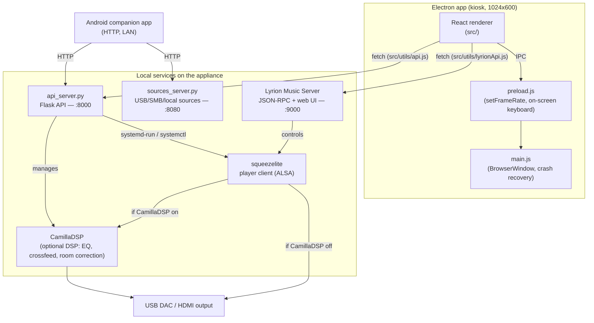

# Architecture

Technical reference for how Osmium Sound is put together — components,
processes, ports, update pipeline, and project layout. For a user-facing
overview, features, and specs, see [README.md](README.md).

## System overview



## Components

| Component | Path | Role |
|---|---|---|
| Electron main | `main/main.js` | Window/kiosk management, renderer crash recovery, relaxes CSP only for the local Lyrion origin so the renderer can call its JSON-RPC API |
| Preload | `main/preload.js` | Minimal `contextBridge` surface — only UI-local concerns (frame-rate cap, global on-screen keyboard). **System control does not go through IPC.** |
| React renderer | `src/` | The touchscreen UI (Now Playing, Music/Radio/Apps via Lyrion, Settings, Setup Wizard) |
| Flask API | `api_server.py` | Runs as root on the appliance; system info/control, network/Wi-Fi, OTA channels, DSP, multiroom (LMS role), pairing tokens. Port `8000`. |
| Sources service | `sources_server.py` | USB/SMB/local source management, internal-disk adoption/formatting, backup/restore, FIR filter upload, and a DSP control proxy to the loopback-only Flask API. Port `8080`. |
| Lyrion Music Server | external (Debian package / on-demand download) | Library indexing, playback engine, plugin ecosystem (Spotty, TIDAL Connect, radio, UPnP/DLNA, AirPlay). Port `9000`. |
| squeezelite | systemd service | Lyrion's player client; `-D` flag enables bit-perfect DSD via DoP; `-v` exports a shared-memory buffer the VU meter reads |
| CamillaDSP | systemd-managed, optional | Parametric EQ, headphone crossfeed, room correction from an uploaded filter. Off by default — bit-perfect path is untouched unless enabled. |
| VU meter daemon | `vu_meter_daemon.py` | Reads squeezelite's shared-memory visualizer segment (`/dev/shm/squeezelite-*`) via mmap, auto-detecting the header layout, computes 32-bar RMS and streams it over WebSocket to `AnalogVUMeter.jsx`. Re-attaches on shm inode changes (DAC switch, restart, multiroom follow-switch); falls back to a Bluetooth loopback tap (see [Bluetooth audio](#bluetooth-audio-a2dp-sink)) when squeezelite has nothing playing. |
| Bluetooth watcher | `hifi-bt-watcher.py` (system OTA channel) | Watches BlueZ over D-Bus; on the first active A2DP transport, pauses the local Lyrion player and CamillaDSP (if running) and restarts `hifi-bt-aplay`; publishes AVRCP Now Playing metadata to `/run/hifi-bt/now-playing.json`. Optional, off by default. |
| Android companion | `android-companion/` | Native Android app; talks to the Flask API and Lyrion over HTTP/LAN after QR-code pairing |

### Appliance systemd services

| Unit | Runs | Notes |
|---|---|---|
| `hifi-api` | `api_server.py` | Flask API, port 8000 |
| `hifi-sources` | `sources_server.py` | Sources/disk/pairing API, port 8080 |
| `hifi-vumeter` | `vu_meter_daemon.py` | VU meter shared-memory reader |
| `hifi-firstboot` | `hifi-firstboot.sh` | One-shot: re-installs Lyrion (purged by the live-installer), then deletes its own unit — see [First boot & setup](#first-boot--setup) |
| `squeezelite` | — | Lyrion's player client |
| `hifi-bluealsa` | BlueALSA daemon (`-p a2dp-sink`) | Bluetooth A2DP sink backend. Disabled by default — see [Bluetooth audio](#bluetooth-audio-a2dp-sink) |
| `hifi-bt-agent` | `bt-agent -c NoInputNoOutput` | Headless pairing agent (no PIN prompt) |
| `hifi-bt-aplay` | `hifi-bt-aplay-run` | Plays the A2DP stream to the current DAC (+ a VU-meter tap when possible); restarted by the watcher on every handover |
| `hifi-bt-watcher` | `hifi-bt-watcher.py` | DAC handover + Now Playing metadata (see table above) |

`camilladsp.service` is enabled/controlled at runtime (`DSP_UNIT` in
`api_server.py`, binary `/usr/local/bin/camilladsp`, config
`/etc/camilladsp/config.yml`) but has **no unit file in this repo** — it
ships from the base image, not from `distro/config/`.

## Multiroom

Each device always runs its own local squeezelite + Lyrion — LMS instances
don't cross-discover each other. "Follow" mode (`GET/POST /lms_role` in
`api_server.py`) rewrites the local squeezelite's `-s <host>` argument to
point at *another* Osmium device's Lyrion instance and restarts the service,
so grouping/sync happens natively inside that one LMS. `GET /discover_lms`
finds candidate servers on the LAN using the real Slim/Squeezebox discovery
protocol (UDP broadcast, port 3483) — no manual IP entry needed.
`GET/POST /player_name` names each device so grouped players are easy to
tell apart in the Lyrion UI.

## Bluetooth audio (A2DP sink)

Optional, off by default (`GET/POST /bluetooth_status`, `/bluetooth_set` in
`api_server.py`, persisted to `/etc/hifi-player/bluetooth.json`). Lets a
phone connect and stream straight to the DAC, like a Bluetooth speaker — no
app or account. Stack is BlueZ + BlueALSA (not PulseAudio/PipeWire), so the
bit-perfect ALSA path used when Bluetooth is off/idle is untouched.

**Prerequisites & reconciliation** — `distro/os-update/apply.d/0024-bluetooth.sh`
installs `bluez`/`bluez-tools`/`bluez-alsa-utils` and four disabled systemd
units (table above). `0009-faster-boot-2.sh` blacklists `btusb`/`bluetooth`
and masks `bluetooth.service` on *every* OS update (cumulative migration, for
fast boot on the common case); `0024` always runs after it and re-applies the
user's persisted choice on top, so Bluetooth enabled from Settings survives
the next OS update instead of being silently reverted.

**DAC handover** — squeezelite (`-C 5` idle timeout) and CamillaDSP (when
DSP is on) are the two things that can hold the real DAC. `hifi-bt-watcher.py`
watches BlueZ D-Bus signals directly (via `dbus-monitor`, not python3-dbus —
consistent with the rest of the appliance shelling out to CLI tools for
D-Bus-backed services like NetworkManager): when the first A2DP transport
goes active, it pauses the local Lyrion player over JSON-RPC and stops
CamillaDSP if it was running (flag file `/run/hifi-bt/camilla-stopped` so it
knows whether to restart it afterward), then restarts `hifi-bt-aplay.service`
so it can open the now-free DAC. Local playback is never auto-resumed. This
mirrors the release-before-open ordering `api_server.py`'s DSP toggle already
uses between squeezelite and CamillaDSP.

**VU meter tap** — `hifi-bt-aplay-run` fans the A2DP audio out (ALSA `route`
+ `multi`) to an unused CamillaDSP Loopback subdevice pair (DEV=0/1,
SUBDEV=1 — DSP itself only ever uses SUBDEV=0, so this doesn't collide with
it) whenever the Loopback card is present, which it unconditionally is since
migration `0015-camilladsp.sh`. `vu_meter_daemon.py` captures that tap with
`arecord` and reuses its existing RMS→dB→percent mapping, so the analog VU
meters keep moving during Bluetooth playback; falls back to the DAC alone
(no VU) if the tap config can't be set up.

**Now Playing metadata** — the watcher also follows `org.bluez.MediaPlayer1`
AVRCP properties (Title/Artist/Album/Position) and writes them to
`/run/hifi-bt/now-playing.json`. `GET /bluetooth_now_playing` in
`api_server.py` adds a `cover_url` on top via a best-effort online lookup
(iTunes Search API, in-memory cache) — Bluetooth never carries reliable cover
art (BlueZ's own AVRCP art support is experimental). The renderer's
`BluetoothNowPlaying.jsx` polls this and renders a small top banner (title,
artist, cover, device name) whenever Bluetooth is actively streaming,
independent of the regular Lyrion-driven Now Playing panel (which has
nothing to show while the local player is paused for a BT session).

Not yet implemented: Bluetooth as an *output* (appliance → BT
headphones/speakers) — a natural fase 2, tracked in `ANALISI-CONCORRENTI.md`.

## Pairing & security

The Android companion pairs via a bearer token, not a password. Minting a
token (`POST /api/pair/token` in `sources_server.py`, `secrets.token_urlsafe(24)`,
persisted to `/etc/hifi-pairing-tokens.json`) and revoking all tokens are
**localhost-only** — they require physical access to the kiosk screen
(Settings shows the token as a QR code). After pairing, the companion app
sends `Authorization: Bearer <token>`; a second flow appends `?token=` to
plain URLs (backup/restore, the sources web UI) since `<a href>` navigation
can't set headers. `_require_pair_token()` gates `/api/dsp/*`,
`/api/internal/*`, and `/api/usb`, with per-IP rate limiting
(20 failures / 60s).

SSH ships **disabled**. `GET/POST /ssh_status` / `/ssh_set` in
`api_server.py` installs `openssh-server` on demand and, before starting
`sshd`, drops `/etc/ssh/sshd_config.d/99-hifi-no-root-login.conf`
(`PermitRootLogin no`) — the kiosk `hifi` user ships with a well-known
default password, so this ensures a leaked password only ever grants
unprivileged access, never root. The same hardening is reapplied by the
OS-update channel (`distro/os-update/apply.d/0017-ssh-no-root-login.sh`).

## Backend API reference

The renderer never talks to the OS directly — everything goes through one of
two local HTTP services.

### Flask API — `api_server.py` (port 8000)

Called via [`src/utils/api.js`](src/utils/api.js) (`apiGet`/`apiPost`). Selected routes:

```
GET  /system_info            hostname, platform, arch, versions
GET  /network_info           network interfaces
GET  /audio_devices           detected DACs/outputs
POST /set_audio_device
POST /reboot | /shutdown
GET/POST /ota_channel        dev | prod
GET/POST /{app,system,os,lyrion}_update/{check,apply,status}
GET/POST /dsp_status, /dsp_set
GET/POST /lms_role           multiroom "follow" mode
GET/POST /player_name
GET  /discover_lms            LAN auto-discovery for multiroom
GET/POST /ssh_status, /ssh_set
GET/POST /pointer_status, /pointer_set
GET  /roomcorr/mics           USB measurement-mic candidates (arecord -l)
POST /roomcorr/measure        guided room measurement (async systemd-run job)
GET  /roomcorr/status         poll the measurement; carries the result curves
POST /roomcorr/apply|discard  activate or delete the generated FIR
GET/POST /bluetooth_status, /bluetooth_set    Bluetooth A2DP sink on/off + paired devices
POST /bluetooth_discoverable  make the device visible for pairing (2 min)
POST /bluetooth_forget        unpair a device
GET  /bluetooth_now_playing   current Bluetooth track (AVRCP + online cover lookup)
```

The full route table is the source of truth — see the `@app.route` decorators
in `api_server.py`.

### Sources API — `sources_server.py` (port 8080)

Called via the sources SPA and the Android companion app. Routes marked 🔒
require the pairing bearer token (or `?token=`) — see
[Pairing & security](#pairing--security). Selected routes:

```
GET    /api/sources                     list configured sources (unauthenticated: read-only, no secrets)
POST   /api/sources/local          🔒   add a local-folder source
POST   /api/sources/smb            🔒   add an SMB source
DELETE /api/sources/<id>           🔒   remove a source (a.k.a. "un-adopt")
POST   /api/apply                  🔒   push current source config to Lyrion
GET    /api/internal/disks         🔒   internal disks/partitions
POST   /api/internal/adopt         🔒   adopt an existing partition as a source
POST   /api/internal/format        🔒   wipe + mkfs (sfdisk, async systemd-run job)
GET    /api/internal/format/status 🔒   poll a format job
GET/POST /api/internal/smb         🔒   Samba share config
POST   /api/internal/smb/regenerate 🔒  rotate the Samba account password
GET    /api/usb                    🔒   list mounted USB disks for the add-source UI
GET    /api/cd/info                🔒   audio-CD TOC + MusicBrainz metadata
POST   /api/cd/rip                 🔒   rip to FLAC (async systemd-run job)
GET    /api/cd/rip/status          🔒   poll a rip job
POST   /api/cd/eject               🔒   open the tray
POST   /api/pair/token                  mint a companion pairing token (localhost only)
POST   /api/pair/tokens/revoke_all      revoke all tokens (localhost only)
GET/POST /api/dsp/status, /api/dsp/set  🔒   proxy to the loopback-only Flask DSP routes
POST   /api/dsp/fir                🔒   upload a FIR filter for CamillaDSP
GET/POST /api/backup, /api/restore 🔒   full-config backup/restore
```

`_require_pair_token()` exempts calls from `127.0.0.1`/`::1` (the on-device
Electron kiosk needs no token — no network hop), so 🔒 above means "required
for LAN callers (the phone app), waived for the local kiosk." The two
`/api/pair/token*` routes use a stricter, different check (`remote_addr`
must literally be localhost, full stop) since they mint/revoke the very
token the others check — a LAN caller can never satisfy it, kiosk or not.

### Lyrion JSON-RPC — `src/utils/lyrionApi.js` (port 9000)

Playback control talks directly to Lyrion, not the Flask API:

```javascript
lyrionApi.play(playerMac)
lyrionApi.pause(playerMac)
lyrionApi.next(playerMac)
lyrionApi.previous(playerMac)
lyrionApi.setVolume(playerMac, volume)   // 0-100
lyrionApi.seek(playerMac, time)
```

### Electron preload — `main/preload.js`

```javascript
window.electronAPI.setFrameRate(fps)
window.electronAPI.showGlobalKeyboard() / hideGlobalKeyboard()
window.electronAPI.onToggleSimpleKeyboard(callback)
```

## First boot & setup

`hifi-firstboot.service` runs exactly once. Debian's live-installer
(`14remove-live-packages`) purges anything staged into the live image via
chroot hooks — including the Lyrion `.deb` — so first boot re-installs it
from `/opt/hifi-lyrion/*.deb` (falling back to downloading from
`downloads.lms-community.org`), `apt-mark manual`s it, adds the Lyrion
service user to the `cdrom` group (needed for the CD Player plugin), enables
the service, then deletes its own unit file.

The touchscreen Setup Wizard (`src/pages/SetupWizard.jsx`) then walks:
`welcome → network → wifi-scan (optional) → audio → sources → lyrion` —
configuring network (wired/DHCP or Wi-Fi), the audio output device, minting
a sources pairing token/QR, and polling Lyrion install/health before
handing off to the normal UI.

Network configuration (`api_server.py`: `GET /network_status`,
`GET /wifi_scan`, `POST /wifi_connect`, `POST /configure_network`) is
entirely `nmcli`-driven — there is no AP/hotspot fallback mode, so first
contact needs either ethernet or the on-screen Wi-Fi scan.

## OTA update system

Four independent channels, all served from GitHub Releases and applied as
root by helper scripts in `/usr/local/sbin/` (invoked from `api_server.py`
via `systemd-run --no-block --collect`, so the updater survives any service
restart — e.g. lightdm — its own payload triggers). Each channel writes live
progress to `/run/hifi-*-status.json`, polled by the UI via
`GET /{app,system,os,lyrion}_update/status`.

| Channel | Asset prefix | Updates | Verification | Script |
|---|---|---|---|---|
| UI | `hifi-ui-` | `/opt/hifi-media-player` (Electron) | sha256 | `hifi-ota-update.sh` |
| System | `hifi-system-` | Python API/daemons, helper scripts, systemd units | sha256 | `hifi-system-update.sh` |
| OS | `hifi-os-` | arbitrary root `apply.sh` | sha256 **+ Ed25519 signature** | `hifi-os-update.sh` |
| Lyrion | — | Lyrion Music Server `.deb` | version match | `hifi-lyrion-update.sh` |

Devices also pick a **Dev** or **Prod** release channel (Settings → Updates):
`main` tags (`vX.Y.Z`) are the Prod channel; `svil` prerelease tags
(`vX.Y.Z-dev.N`) are the Dev channel and are never picked up by
`releases/latest`.

Note that not every stable release ships a new install ISO — most releases
are OTA-only (OS/System/UI tarballs); a fresh ISO is only cut occasionally.
Check the release's assets on GitHub to see what shipped with it.

### OS channel — why it's signed

The OS payload runs an arbitrary root script (`apply.sh`), unlike UI/System
which just drop verified files in place. For that payload, a plain sha256 is
integrity-only — it proves the download wasn't corrupted, but proves nothing
about *who* produced it, so anyone able to publish a release or MITM the
download could ship arbitrary root code. `hifi-os-update.sh` therefore
requires a detached **Ed25519** signature over the `.sha256` sidecar,
verified against a public key baked into the image at
`/etc/hifi-player/ota-pubkey.pem`:

1. **Authenticity** — the Ed25519 signature of the `.sha256` sidecar verifies
   against the embedded pubkey (`openssl pkeyutl -verify`). The pubkey's
   algorithm is itself checked (`grep -qi ED25519`) so a swapped-in weaker
   key type can't silently downgrade the trust model.
2. **Integrity** — the downloaded tarball's sha256 matches that signed
   digest.

Only if *both* pass does `apply.sh` get extracted and run. Missing key,
missing `openssl`, missing/malformed signature, or a checksum mismatch ⇒ the
update is **refused outright** and nothing is touched
(`distro/config/includes.chroot/usr/local/sbin/hifi-os-update.sh`). The
private signing key never touches the appliance: it's generated offline
(`distro/ota-keys/gen-ota-key.sh`) and lives only as the `OTA_SIGNING_KEY`
GitHub Actions secret used to sign releases in CI; devices only ever hold the
public half.

### OS channel — hardening against a malicious or broken network path

Because a device fetches its own update payload unattended over the internet,
`hifi-os-update.sh` treats every network input as hostile before it's ever
trusted:

- **TLS pinned, no downgrade**: both the tarball and signature URLs must be
  `https://`, and curl is forced to `--proto '=https' --proto-redir '=https'
  --tlsv1.2` — a redirect or malicious release can't quietly point the
  updater at plain HTTP.
- **Bounded downloads**: `--max-filesize` caps the tarball at 500 MiB and the
  signature at 4 KiB, so a hostile or broken URL can't fill the disk (DoS via
  update).
- **Input validation on untrusted arguments**: the sha256 must be exactly 64
  hex chars, and the version string is restricted to a safe charset — both
  are interpolated into filenames/sidecar text, so this blocks injection or
  path traversal via a crafted release.
- **Private, unpredictable workdir**: downloads land in a fresh
  `mktemp -d /var/tmp/hifi-os-ota.XXXXXX` (not a fixed path), avoiding
  symlink/preplaced-file races in the world-writable `/var/tmp`, and `umask
  077` keeps the bytes unreadable to other local users while staged.
- **Sanitized extraction**: `tar --no-same-owner --no-same-permissions` — even
  though the bundle is already signature-verified, this stops a buggy or
  tampered archive from dropping a root-owned setuid file outside `apply.sh`'s
  own control.
- **Scrubbed execution environment**: `apply.sh` runs under `env -i` with a
  fixed `PATH`, receiving only `HIFI_OS_VERSION`/`HIFI_PAYLOAD_DIR` — nothing
  inherited from the API/systemd context can influence the root script.

### OS channel — why an interrupted or corrupted update can't brick the device

There's no A/B partition swap on this appliance — resilience instead comes
from the update being **cumulative, idempotent, and fail-fast**, with the
"this version is installed" marker written only after everything succeeded:

- **Nothing production is touched until both signature and checksum verify.**
  Download and extraction happen entirely in the private temp workdir; a
  corrupted or truncated download simply fails verification and is discarded
  — `apply.sh` never even starts.
- **`distro/os-update/apply.sh` is a thin runner** that sources
  `distro/os-update/lib.sh` and executes every migration in
  `apply.d/NNNN-*.sh` **in order, each in its own isolated subshell**, so one
  migration's failure can't corrupt the runner's own state or leak partial
  shell state into the next migration.
- **Fail-fast, no partial "done" state**: if a migration exits non-zero, the
  runner stops immediately and `hifi-os-update.sh` never writes
  `/etc/hifi-player/OS_VERSION`. The device therefore still reports the old
  version installed, `check_os_update` still sees the same release as
  "available", and the *next* attempt (manual retry, or the next time the
  user hits "Aggiorna ora") re-downloads and re-runs the **same** payload from
  the top — including the migrations that already succeeded.
- **That retry is safe because every migration is idempotent by
  construction**, via `lib.sh` helpers rather than by author discipline:
  - `ensure_file_content` only writes a file if its content actually differs,
    so re-running a migration that already applied is a byte-for-byte no-op.
  - `backup_and_edit` copies the file before a `sed` edit, then runs a
    validator against the result; if validation fails it **automatically
    restores the backup**, so a bad in-place edit (e.g. to `/etc/sudoers`)
    can never leave the file broken.
  - `ensure_pkg` only installs a package if it's not already present.
  - Each of these calls `mark_changed` **only on a real diff**, which is also
    how the runner knows whether to request a reboot — so a fully re-run
    payload that has nothing left to do reports `changed=0` and reboots
    nothing.
- **A power loss or crash mid-`apply.sh` self-heals the same way**: whatever
  migrations completed before the interruption are durable (they already
  wrote their files); `OS_VERSION` still isn't bumped; the next run walks the
  full migration list again, no-ops everything already done, and continues
  from where it was actually interrupted.
- **Because the payload always fetches only `releases/latest`** (no replay of
  intermediate versions), `apply.d/` must contain **every OS change ever
  shipped** as append-only, idempotent migrations — never edit or delete an
  old one. This is what lets a device jump from a very old version straight
  to the newest release safely in one pass.
- **CI enforces the idempotency contract before publishing**: `apply.sh` is
  shellchecked and run **twice** in `build-ui-ota.yml`; the second run must
  report `changed=0` and request no reboot, catching a non-idempotent
  migration before it ever reaches a device.
- **Audit trail**: every migration run appends a row (timestamp, version, id,
  result) to `/var/lib/hifi-player/os-migrations` — under `/var/lib`, not
  `/opt`, so a later UI OTA (which wipes `/opt`) can't erase the OS history.
- **Reboot happens last, and only if actually needed**: a migration opts in
  via `request_reboot` (writes a `REBOOT` marker) only after a real change
  that needs one — since the payload re-runs on every release, an
  unconditional reboot would otherwise reboot the box on every single update.
  `hifi-os-update.sh` honours that marker only after the version file is
  already written and status is already `done`, so a crash right at reboot
  time still leaves the device in a consistent, fully-applied state.

### UI/System channels — atomic swap, not in-place overwrite

The UI channel (`hifi-ota-update.sh`) protects against the classic
full-disk-corruption brick a different way, since it isn't idempotent
migrations but a wholesale file replacement:

- Extracts into a fresh `/opt/hifi-media-player.new`, never into the live
  `/opt/hifi-media-player`.
- **Free-space guard**: computes the uncompressed size from the gzip footer
  and refuses to extract unless the filesystem has enough headroom — a full
  disk during `tar` silently truncates whatever file it was writing, which
  was the root cause of a past brick.
- **Per-file integrity check**: `tar --compare` re-reads the archive against
  every extracted file (not just the main binary) and aborts on any
  size/content mismatch, so a single corrupted `.so`/asar can't slip through.
- **Atomic swap with rollback**: only after both checks pass does it `mv` the
  old app dir aside and the new one into place; if the final `mv` into
  `/opt/hifi-media-player` fails, it restores the previous directory from the
  backup rather than leaving the app dir half-written.
- The kiosk restart (`systemctl restart lightdm`) is the very last step, once
  `UI_VERSION` is already committed.

## Project structure

```
hifi-media-player/
├── main/                    # Electron main process
│   ├── main.js
│   └── preload.js
├── src/                     # React renderer
│   ├── components/
│   ├── pages/               # Settings, SetupWizard, LyrionServer, ...
│   ├── utils/                # api.js (Flask), lyrionApi.js (Lyrion JSON-RPC)
│   └── i18n/                 # en/it locale strings
├── api_server.py            # Flask API (system/network/OTA/DSP/multiroom)
├── sources_server.py         # USB/SMB/local music sources
├── android-companion/       # Android companion app (Kotlin/Java)
├── distro/                  # Custom Debian appliance build (live-build)
│   ├── config/               # live-build includes, hooks, systemd units
│   └── os-update/            # apply.d migrations, apply.sh (cumulative)
├── website/                  # Marketing site (website/index.html)
└── package.json
```

## Local development

```bash
npm install
npm run electron:dev   # Vite + Electron with hot reload
npm run build           # production renderer build
npm run electron        # run the built app
npm run package         # electron-builder distributable
```

`install-dietpi.sh` / `start-fullscreen.sh` are developer conveniences for
testing on a bare DietPi/Debian box by hand — they are **not** how the
appliance ships. The real production path is: flash the install ISO once,
then let the OTA system above keep the device (UI, System, OS, Lyrion) up to
date.
