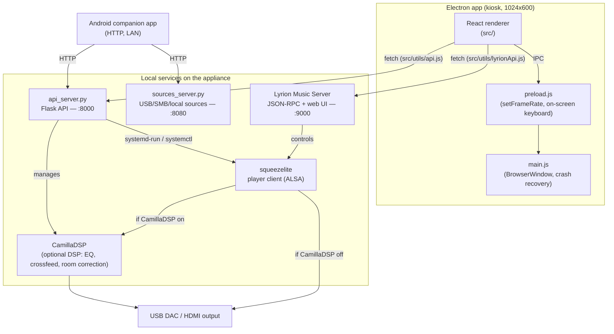

# Architecture

Technical reference for how Osmium Sound is put together — components,
processes, ports, update pipeline, and project layout. For a user-facing
overview, features, and specs, see [README.md](README.md).

## System overview



## Components

| Component | Path | Role |
|---|---|---|
| Electron main | `main/main.js` | Window/kiosk management, renderer crash recovery, relaxes CSP only for the local Lyrion origin so the renderer can call its JSON-RPC API |
| Preload | `main/preload.js` | Minimal `contextBridge` surface — only UI-local concerns (frame-rate cap, global on-screen keyboard). **System control does not go through IPC.** |
| React renderer | `src/` | The touchscreen UI (Now Playing, Music/Radio/Apps via Lyrion, Settings, Setup Wizard) |
| Flask API | `api_server.py` | Runs as root on the appliance; system info/control, network/Wi-Fi, OTA channels, DSP, multiroom (LMS role), pairing tokens. Port `8000`. |
| Sources service | `sources_server.py` | USB/SMB/local source management, internal-disk adoption/formatting, backup/restore, FIR filter upload, and a DSP control proxy to the loopback-only Flask API. Port `8080`. |
| Lyrion Music Server | external (Debian package / on-demand download) | Library indexing, playback engine, plugin ecosystem (Spotty, TIDAL Connect, radio, UPnP/DLNA, AirPlay). Port `9000`. |
| squeezelite | systemd service | Lyrion's player client; `-D` flag enables bit-perfect DSD via DoP; `-v` exports a shared-memory buffer the VU meter reads |
| CamillaDSP | systemd-managed, optional | Parametric EQ, headphone crossfeed, room correction from an uploaded filter. Off by default — bit-perfect path is untouched unless enabled. |
| VU meter daemon | `vu_meter_daemon.py` | Reads squeezelite's shared-memory visualizer segment (`/dev/shm/squeezelite-*`) via mmap, auto-detecting the header layout, computes 32-bar RMS and streams it over WebSocket to `AnalogVUMeter.jsx`. Re-attaches on shm inode changes (DAC switch, restart, multiroom follow-switch). |
| Android companion | `android-companion/` | Native Android app; talks to the Flask API and Lyrion over HTTP/LAN after QR-code pairing |

### Appliance systemd services

| Unit | Runs | Notes |
|---|---|---|
| `hifi-api` | `api_server.py` | Flask API, port 8000 |
| `hifi-sources` | `sources_server.py` | Sources/disk/pairing API, port 8080 |
| `hifi-vumeter` | `vu_meter_daemon.py` | VU meter shared-memory reader |
| `hifi-firstboot` | `hifi-firstboot.sh` | One-shot: re-installs Lyrion (purged by the live-installer), then deletes its own unit — see [First boot & setup](#first-boot--setup) |
| `squeezelite` | — | Lyrion's player client |

`camilladsp.service` is enabled/controlled at runtime (`DSP_UNIT` in
`api_server.py`, binary `/usr/local/bin/camilladsp`, config
`/etc/camilladsp/config.yml`) but has **no unit file in this repo** — it
ships from the base image, not from `distro/config/`.

## Multiroom

Each device always runs its own local squeezelite + Lyrion — LMS instances
don't cross-discover each other. "Follow" mode (`GET/POST /lms_role` in
`api_server.py`) rewrites the local squeezelite's `-s <host>` argument to
point at *another* Osmium device's Lyrion instance and restarts the service,
so grouping/sync happens natively inside that one LMS. `GET /discover_lms`
finds candidate servers on the LAN using the real Slim/Squeezebox discovery
protocol (UDP broadcast, port 3483) — no manual IP entry needed.
`GET/POST /player_name` names each device so grouped players are easy to
tell apart in the Lyrion UI.

## Pairing & security

The Android companion pairs via a bearer token, not a password. Minting a
token (`POST /api/pair/token` in `sources_server.py`, `secrets.token_urlsafe(24)`,
persisted to `/etc/hifi-pairing-tokens.json`) and revoking all tokens are
**localhost-only** — they require physical access to the kiosk screen
(Settings shows the token as a QR code). After pairing, the companion app
sends `Authorization: Bearer <token>`; a second flow appends `?token=` to
plain URLs (backup/restore, the sources web UI) since `<a href>` navigation
can't set headers. `_require_pair_token()` gates `/api/dsp/*`,
`/api/internal/*`, and `/api/usb`, with per-IP rate limiting
(20 failures / 60s).

SSH ships **disabled**. `GET/POST /ssh_status` / `/ssh_set` in
`api_server.py` installs `openssh-server` on demand and, before starting
`sshd`, drops `/etc/ssh/sshd_config.d/99-hifi-no-root-login.conf`
(`PermitRootLogin no`) — the kiosk `hifi` user ships with a well-known
default password, so this ensures a leaked password only ever grants
unprivileged access, never root. The same hardening is reapplied by the
OS-update channel (`distro/os-update/apply.d/0017-ssh-no-root-login.sh`).

## Backend API reference

The renderer never talks to the OS directly — everything goes through one of
two local HTTP services.

### Flask API — `api_server.py` (port 8000)

Called via [`src/utils/api.js`](src/utils/api.js) (`apiGet`/`apiPost`). Selected routes:

```
GET  /system_info            hostname, platform, arch, versions
GET  /network_info           network interfaces
GET  /audio_devices           detected DACs/outputs
POST /set_audio_device
POST /reboot | /shutdown
GET/POST /ota_channel        dev | prod
GET/POST /{app,system,os,lyrion}_update/{check,apply,status}
GET/POST /dsp_status, /dsp_set
GET/POST /lms_role           multiroom "follow" mode
GET/POST /player_name
GET  /discover_lms            LAN auto-discovery for multiroom
GET/POST /ssh_status, /ssh_set
GET/POST /pointer_status, /pointer_set
```

The full route table is the source of truth — see the `@app.route` decorators
in `api_server.py`.

### Sources API — `sources_server.py` (port 8080)

Called via the sources SPA and the Android companion app. Routes marked 🔒
require the pairing bearer token (or `?token=`) — see
[Pairing & security](#pairing--security). Selected routes:

```
GET    /api/sources                     list configured sources
DELETE /api/sources/<id>                remove a source (a.k.a. "un-adopt")
GET    /api/internal/disks              internal disks/partitions
POST   /api/internal/adopt         🔒   adopt an existing partition as a source
POST   /api/internal/format        🔒   wipe + mkfs (sfdisk, async systemd-run job)
GET    /api/internal/format/status      poll a format job
GET/POST /api/internal/smb              Samba share config
POST   /api/internal/smb/regenerate     rotate the Samba account password
POST   /api/pair/token                  mint a companion pairing token (localhost only)
POST   /api/pair/tokens/revoke_all      revoke all tokens (localhost only)
GET/POST /api/dsp/status, /api/dsp/set  🔒   proxy to the loopback-only Flask DSP routes
POST   /api/dsp/fir                🔒   upload a FIR filter for CamillaDSP
GET/POST /api/backup, /api/restore 🔒   full-config backup/restore
```

### Lyrion JSON-RPC — `src/utils/lyrionApi.js` (port 9000)

Playback control talks directly to Lyrion, not the Flask API:

```javascript
lyrionApi.play(playerMac)
lyrionApi.pause(playerMac)
lyrionApi.next(playerMac)
lyrionApi.previous(playerMac)
lyrionApi.setVolume(playerMac, volume)   // 0-100
lyrionApi.seek(playerMac, time)
```

### Electron preload — `main/preload.js`

```javascript
window.electronAPI.setFrameRate(fps)
window.electronAPI.showGlobalKeyboard() / hideGlobalKeyboard()
window.electronAPI.onToggleSimpleKeyboard(callback)
```

## First boot & setup

`hifi-firstboot.service` runs exactly once. Debian's live-installer
(`14remove-live-packages`) purges anything staged into the live image via
chroot hooks — including the Lyrion `.deb` — so first boot re-installs it
from `/opt/hifi-lyrion/*.deb` (falling back to downloading from
`downloads.lms-community.org`), `apt-mark manual`s it, adds the Lyrion
service user to the `cdrom` group (needed for the CD Player plugin), enables
the service, then deletes its own unit file.

The touchscreen Setup Wizard (`src/pages/SetupWizard.jsx`) then walks:
`welcome → network → wifi-scan (optional) → audio → sources → lyrion` —
configuring network (wired/DHCP or Wi-Fi), the audio output device, minting
a sources pairing token/QR, and polling Lyrion install/health before
handing off to the normal UI.

Network configuration (`api_server.py`: `GET /network_status`,
`GET /wifi_scan`, `POST /wifi_connect`, `POST /configure_network`) is
entirely `nmcli`-driven — there is no AP/hotspot fallback mode, so first
contact needs either ethernet or the on-screen Wi-Fi scan.

## OTA update system

Four independent channels, all served from GitHub Releases:

| Channel | Asset prefix | Updates | Verification |
|---|---|---|---|
| UI | `hifi-ui-` | `/opt/hifi-media-player` (Electron) | sha256 |
| System | `hifi-system-` | Python API/daemons, helper scripts, systemd units | sha256 |
| OS | `hifi-os-` | arbitrary root `apply.sh` | sha256 **+ Ed25519 signature** |
| Lyrion | — | Lyrion Music Server `.deb` | version match |

The OS channel is signed because its payload runs an arbitrary root script;
the signature is checked against a public key baked into the image
(`/etc/hifi-player/ota-pubkey.pem`) before the sha256-verified tarball is
applied. `distro/os-update/apply.sh` is **cumulative** — every OS change ever
shipped lives there as an idempotent block, since a device jumping straight to
the latest release only ever runs the latest `apply.sh` once.

Devices also pick a **Dev** or **Prod** release channel (Settings → Updates):
`main` tags (`vX.Y.Z`) are the Prod channel; `svil` prerelease tags
(`vX.Y.Z-dev.N`) are the Dev channel and are never picked up by
`releases/latest`.

Note that not every stable release ships a new install ISO — most releases
are OTA-only (OS/System/UI tarballs); a fresh ISO is only cut occasionally.
Check the release's assets on GitHub to see what shipped with it.

## Project structure

```
hifi-media-player/
├── main/                    # Electron main process
│   ├── main.js
│   └── preload.js
├── src/                     # React renderer
│   ├── components/
│   ├── pages/               # Settings, SetupWizard, LyrionServer, ...
│   ├── utils/                # api.js (Flask), lyrionApi.js (Lyrion JSON-RPC)
│   └── i18n/                 # en/it locale strings
├── api_server.py            # Flask API (system/network/OTA/DSP/multiroom)
├── sources_server.py         # USB/SMB/local music sources
├── android-companion/       # Android companion app (Kotlin/Java)
├── distro/                  # Custom Debian appliance build (live-build)
│   ├── config/               # live-build includes, hooks, systemd units
│   └── os-update/            # apply.d migrations, apply.sh (cumulative)
├── website/                  # Marketing site (website/index.html)
└── package.json
```

## Local development

```bash
npm install
npm run electron:dev   # Vite + Electron with hot reload
npm run build           # production renderer build
npm run electron        # run the built app
npm run package         # electron-builder distributable
```

`install-dietpi.sh` / `start-fullscreen.sh` are developer conveniences for
testing on a bare DietPi/Debian box by hand — they are **not** how the
appliance ships. The real production path is: flash the install ISO once,
then let the OTA system above keep the device (UI, System, OS, Lyrion) up to
date.
