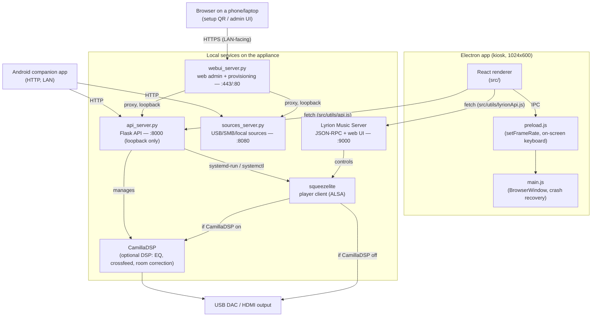

# Architecture

Technical reference for how Osmium Sound is put together — components,
processes, ports, update pipeline, and project layout. For a user-facing
overview, features, and specs, see [README.md](README.md).

## System overview



## Components

| Component | Path | Role |
|---|---|---|
| Electron main | `main/main.js` | Window/kiosk management, renderer crash recovery, relaxes CSP only for the local Lyrion origin so the renderer can call its JSON-RPC API |
| Preload | `main/preload.js` | Minimal `contextBridge` surface — only UI-local concerns (frame-rate cap, global on-screen keyboard). **System control does not go through IPC.** |
| React renderer | `src/` | The touchscreen UI (Now Playing, Music/Radio/Apps via Lyrion, Settings, Setup Wizard) |
| Flask API | `api_server.py` | Runs as root on the appliance; system info/control, network/Wi-Fi, OTA channels, DSP, multiroom (LMS role), pairing tokens, display mode, player on/off, disk installer. Loopback-only, port `8000`. |
| Sources service | `sources_server.py` | USB/SMB/local source management, internal-disk adoption/formatting, backup/restore (core logic shared via `hifi_backup.py`), FIR filter upload, and a DSP control proxy to the loopback-only Flask API. Port `8080`. |
| Web admin / provisioning gateway | `webui_server.py` | The only LAN-facing service: serves the Vue admin app (`admin-webui/`) behind a session, reverse-proxies a whitelisted subset of `api_server.py`/`sources_server.py` calls, and — while `/etc/hifi-player/provisioning-pending` exists — raises a Wi-Fi hotspot and serves the QR-only captive setup/install portal. HTTPS `:443` (+ `:80` redirect), self-signed per-device cert. See [Provisioning & first boot](#provisioning--first-boot). |
| Lyrion Music Server | external (Debian package / on-demand download) | Library indexing, playback engine, plugin ecosystem (Spotty, TIDAL Connect, radio, UPnP/DLNA, AirPlay). Port `9000`. |
| squeezelite | systemd service | Lyrion's player client; `-D` flag enables bit-perfect DSD via DoP; `-v` exports a shared-memory buffer the VU meter reads |
| CamillaDSP | systemd-managed, optional | Parametric EQ, headphone crossfeed, room correction from an uploaded filter. Off by default — bit-perfect path is untouched unless enabled. |
| VU meter daemon | `vu_meter_daemon.py` | Reads squeezelite's shared-memory visualizer segment (`/dev/shm/squeezelite-*`) via mmap, auto-detecting the header layout, computes 32-bar RMS and streams it over WebSocket to `AnalogVUMeter.jsx`. Re-attaches on shm inode changes (DAC switch, restart, multiroom follow-switch); falls back to a Bluetooth loopback tap (see [Bluetooth audio](#bluetooth-audio-a2dp-sink)) when squeezelite has nothing playing. |
| Bluetooth watcher | `hifi-bt-watcher.py` (system OTA channel) | Watches BlueZ over D-Bus; on the first active A2DP transport, pauses the local Lyrion player and CamillaDSP (if running) and restarts `hifi-bt-aplay`; publishes AVRCP Now Playing metadata to `/run/hifi-bt/now-playing.json`. Optional, off by default. |
| Android companion | `android-companion/` | Native Android app; talks to the Flask API and Lyrion over HTTP/LAN after QR-code pairing |

### Appliance systemd services

| Unit | Runs | Notes |
|---|---|---|
| `hifi-api` | `api_server.py` | Flask API, port 8000 |
| `hifi-sources` | `sources_server.py` | Sources/disk/pairing API, port 8080 |
| `hifi-webui` | `webui_server.py` | Web admin + provisioning gateway, port 443/80. Enabled at image-build time (no-op portwise on a fully configured unit; the provisioning marker gates the hotspot/captive behaviour) — see [Provisioning & first boot](#provisioning--first-boot) |
| `hifi-vumeter` | `vu_meter_daemon.py` | VU meter shared-memory reader |
| `hifi-firstboot` | `hifi-firstboot.sh` | One-shot: installs Lyrion (absent from the image by design), then deletes its own unit — see [Provisioning & first boot](#provisioning--first-boot) |
| `squeezelite` | — | Lyrion's player client |
| `hifi-bluealsa` | BlueALSA daemon (`-p a2dp-sink`) | Bluetooth A2DP sink backend. Disabled by default — see [Bluetooth audio](#bluetooth-audio-a2dp-sink) |
| `hifi-bt-agent` | `bt-agent -c NoInputNoOutput` | Headless pairing agent (no PIN prompt) |
| `hifi-bt-aplay` | `hifi-bt-aplay-run` | Plays the A2DP stream to the current DAC (+ a VU-meter tap when possible); restarted by the watcher on every handover |
| `hifi-bt-watcher` | `hifi-bt-watcher.py` | DAC handover + Now Playing metadata (see table above) |

`camilladsp.service` is enabled/controlled at runtime (`DSP_UNIT` in
`api_server.py`, binary `/usr/local/bin/camilladsp`, config
`/etc/camilladsp/config.yml`) but has **no unit file in this repo** — it
ships from the base image, not from `distro/config/`.

## Multiroom

Each device always runs its own local squeezelite + Lyrion — LMS instances
don't cross-discover each other. "Follow" mode (`GET/POST /lms_role` in
`api_server.py`) rewrites the local squeezelite's `-s <host>` argument to
point at *another* Osmium device's Lyrion instance and restarts the service,
so grouping/sync happens natively inside that one LMS. `GET /discover_lms`
finds candidate servers on the LAN using the real Slim/Squeezebox discovery
protocol (UDP broadcast, port 3483) — no manual IP entry needed.
`GET/POST /player_name` names each device so grouped players are easy to
tell apart in the Lyrion UI.

## Bluetooth audio (A2DP sink)

Optional, off by default (`GET/POST /bluetooth_status`, `/bluetooth_set` in
`api_server.py`, persisted to `/etc/hifi-player/bluetooth.json`). Lets a
phone connect and stream straight to the DAC, like a Bluetooth speaker — no
app or account. Stack is BlueZ + BlueALSA (not PulseAudio/PipeWire), so the
bit-perfect ALSA path used when Bluetooth is off/idle is untouched.

**Prerequisites & reconciliation** — `distro/os-update/apply.d/0024-bluetooth.sh`
installs `bluez`/`bluez-tools`/`bluez-alsa-utils` and four disabled systemd
units (table above). `0009-faster-boot-2.sh` blacklists `btusb`/`bluetooth`
and masks `bluetooth.service` on *every* OS update (cumulative migration, for
fast boot on the common case); `0024` always runs after it and re-applies the
user's persisted choice on top, so Bluetooth enabled from Settings survives
the next OS update instead of being silently reverted.

**DAC handover** — squeezelite (`-C 5` idle timeout) and CamillaDSP (when
DSP is on) are the two things that can hold the real DAC. `hifi-bt-watcher.py`
watches BlueZ D-Bus signals directly (via `dbus-monitor`, not python3-dbus —
consistent with the rest of the appliance shelling out to CLI tools for
D-Bus-backed services like NetworkManager): when the first A2DP transport
goes active, it pauses the local Lyrion player over JSON-RPC and stops
CamillaDSP if it was running (flag file `/run/hifi-bt/camilla-stopped` so it
knows whether to restart it afterward), then restarts `hifi-bt-aplay.service`
so it can open the now-free DAC. Local playback is never auto-resumed. This
mirrors the release-before-open ordering `api_server.py`'s DSP toggle already
uses between squeezelite and CamillaDSP.

**VU meter tap** — `hifi-bt-aplay-run` fans the A2DP audio out (ALSA `route`
+ `multi`) to an unused CamillaDSP Loopback subdevice pair (DEV=0/1,
SUBDEV=1 — DSP itself only ever uses SUBDEV=0, so this doesn't collide with
it) whenever the Loopback card is present, which it unconditionally is since
migration `0015-camilladsp.sh`. `vu_meter_daemon.py` captures that tap with
`arecord` and reuses its existing RMS→dB→percent mapping, so the analog VU
meters keep moving during Bluetooth playback; falls back to the DAC alone
(no VU) if the tap config can't be set up.

**Now Playing metadata** — the watcher also follows `org.bluez.MediaPlayer1`
AVRCP properties (Title/Artist/Album/Position) and writes them to
`/run/hifi-bt/now-playing.json`. `GET /bluetooth_now_playing` in
`api_server.py` adds a `cover_url` on top via a best-effort online lookup
(iTunes Search API, in-memory cache) — Bluetooth never carries reliable cover
art (BlueZ's own AVRCP art support is experimental). The renderer's
`BluetoothNowPlaying.jsx` polls this and renders a small top banner (title,
artist, cover, device name) whenever Bluetooth is actively streaming,
independent of the regular Lyrion-driven Now Playing panel (which has
nothing to show while the local player is paused for a BT session).

Not yet implemented: Bluetooth as an *output* (appliance → BT
headphones/speakers) — a natural fase 2, tracked in `ANALISI-CONCORRENTI.md`.

## Backup & restore

`hifi_backup.py` is the shared core (imported by both `sources_server.py`,
which exposes the HTTP routes, and the worker below), so the set of paths a
backup can read and the set a restore may write are always the same table.

**Deliberately a profile backup, not a rootfs image.** The OS is already
reproducible from the install ISO plus the cumulative OS-update migrations
(see [OTA update system](#ota-update-system)), so this never touches
`OS_VERSION`/`SYSTEM_VERSION`, the OTA signing pubkey, or per-device identity
(`webui-secret.key`, TLS cert, `/etc/machine-id`) — a hard deny-list enforced
on both the archiving and the restoring side. Restoring those would only ever
fight the updater or clone one device's session identity onto another.

**Categories**: `core` (DAC/DSP/EQ/pointer/OTA channel), `sources` (the music
source list — kept in every backup, but with SMB passwords redacted unless
encrypted), `lyrion` (prefs + playlists, *not* the scanned library cache,
which Lyrion rebuilds on its own), `network` (Wi-Fi profiles only — Ethernet
carries no secret and recreates itself), `accounts` (web-admin DB via
SQLite's own backup API for a consistent snapshot, Samba credentials, pairing
tokens) and `bluetooth` (link keys). The last three are flagged *secret* and
only ever enter an archive when a passphrase is supplied — a scheduled
(unattended) backup therefore always sticks to the non-secret half.

**Integrity, not DietPi's rsync-mirror model.** A generation on
`/var/lib/hifi-player/backups/<timestamp>/` is a `.tar.gz` (or `.tar.gz.enc`)
plus a `manifest.json` written **last**; a directory without one is an
interrupted build, is invisible to the listing, and is pruned on the next
run — an interrupted backup can never be mistaken for a good one. Every
member's sha256 is checked before it's written back during a restore.
Encryption is optional (openssl AES-256-CTR, PBKDF2, encrypt-then-HMAC so a
wrong passphrase or a tampered file is rejected before anything is decrypted).

**Building** a generation runs via `hifi-backup-run.py`, the same
`systemd-run --no-block` + `/run/hifi-backup-status.json` poll shape as the
disk-format and CD-rip jobs — nothing is stopped while it runs, because each
format that can't be safely byte-copied has its own consistent-snapshot path
(SQLite backup API, a YAML re-parse-and-retry for Lyrion's live prefs).
**Restoring** does stop `lyrionmusicserver` around the prefs it's about to
overwrite (an explicit, rare action, unlike backup), takes an automatic
"pre-restore" safety generation first, and restarts only the services whose
files actually changed — CamillaDSP is never turned on by a restore that
finds it off.

Scheduling (`hifi-backup.timer`, weekly, `Persistent=false`) ships via
`distro/os-update/apply.d/0033-backup-scheduler.sh`, same pattern as the
Bluetooth units above: installed disabled, reconciled against the user's
choice in `/etc/hifi-player/backup.json` on every OS update. A factory reset
wipes `/var/lib/hifi-player/backups` — otherwise a device handed to someone
else would carry the previous owner's Wi-Fi/SMB/admin credentials in an
encrypted backup they never asked to keep.

Both the sources SPA (`:8080`, phone/QR flow — `GET/POST /api/backup*`,
`/api/restore`) and the web-admin (`/api/system/backup*`, `/api/system/restore`,
session-gated forward in `webui_server.py`) expose the same feature; the plain
`GET /api/backup` link (no passphrase — an `<a href>` can't send one) stays
the always-available "just get me a file" path used by both UIs.

## Pairing & security

The Android companion pairs via a bearer token, not a password. Minting a
token (`POST /api/pair/token` in `sources_server.py`, `secrets.token_urlsafe(24)`,
persisted to `/etc/hifi-pairing-tokens.json`) and revoking all tokens are
**localhost-only** — they require physical access to the kiosk screen
(Settings shows the token as a QR code). After pairing, the companion app
sends `Authorization: Bearer <token>`; a second flow appends `?token=` to
plain URLs (backup/restore, the sources web UI) since `<a href>` navigation
can't set headers. `_require_pair_token()` gates every `sources_server.py`
route that isn't localhost-only for minting — including the sources page
itself (`GET /`) and the source listing (`GET /api/sources`), so a device on
the LAN that isn't paired and isn't going through the webui:443 proxy or the
Electron kiosk (both loopback) can't reach the Sources UI or its data at all
— with per-IP rate limiting (20 failures / 60s).

SSH ships **disabled**. `GET/POST /ssh_status` / `/ssh_set` in
`api_server.py` installs `openssh-server` on demand and, before starting
`sshd`, drops `/etc/ssh/sshd_config.d/99-hifi-no-root-login.conf`
(`PermitRootLogin no`) — the kiosk `hifi` user ships with a well-known
default password, so this ensures a leaked password only ever grants
unprivileged access, never root. The same hardening is reapplied by the
OS-update channel (`distro/os-update/apply.d/0017-ssh-no-root-login.sh`).

## Backend API reference

The renderer never talks to the OS directly — everything goes through one of
two local HTTP services.

### Flask API — `api_server.py` (port 8000)

Called via [`src/utils/api.js`](src/utils/api.js) (`apiGet`/`apiPost`). Selected routes:

```
GET  /system_info            hostname, platform, arch, versions
GET  /network_info           network interfaces
GET  /audio_devices           detected DACs/outputs
POST /set_audio_device
POST /reboot | /shutdown
GET/POST /ota_channel        dev | prod
GET/POST /{app,system,os,lyrion}_update/{check,apply,status}
GET/POST /dsp_status, /dsp_set
GET/POST /lms_role           multiroom "follow" mode
GET/POST /player_name
GET  /discover_lms            LAN auto-discovery for multiroom
GET/POST /ssh_status, /ssh_set
GET/POST /pointer_status, /pointer_set
GET/POST /display_mode        screen (gui) vs headless
GET/POST /player_enabled      player on/off — independent of display_mode, makes a unit "server-only"
GET  /boot_mode                'installer' (hifi.installer=1) vs 'live', read from /proc/cmdline
GET  /install/disks            candidate target disks for the disk installer
POST /install/start            launch hifi-disk-install.sh (async systemd-run job)
GET  /install/status           poll the running/finished install job
GET  /roomcorr/mics           USB measurement-mic candidates (arecord -l)
POST /roomcorr/measure        guided room measurement (async systemd-run job)
GET  /roomcorr/status         poll the measurement; carries the result curves
POST /roomcorr/apply|discard  activate or delete the generated FIR
GET/POST /bluetooth_status, /bluetooth_set    Bluetooth A2DP sink on/off + paired devices
POST /bluetooth_discoverable  make the device visible for pairing (2 min)
POST /bluetooth_forget        unpair a device
GET  /bluetooth_now_playing   current Bluetooth track (AVRCP + online cover lookup)
```

The full route table is the source of truth — see the `@app.route` decorators
in `api_server.py`.

### Web admin & provisioning API — `webui_server.py` (port 443/80)

The only LAN-facing surface. Three route families:

- **`/api/system/*`** — session-gated proxy to a whitelisted subset of the
  Flask API above, called by the admin webui (`admin-webui/src/api.js`,
  `api.sys`/`api.sysPost`). A small subset (`display_mode`, `lms_role`,
  `discover_lms`, `audio_devices`, …) is additionally reachable *before*
  login while provisioning is in progress, so the pre-account setup flow can
  use the exact same session-app code path once the Vue app itself is
  reachable.
- **`/api/provision/*`** — pre-auth, gated only by the provisioning marker
  (`_provisioning()`), used exclusively by the captive setup page (see
  [Provisioning & first boot](#provisioning--first-boot)):

  ```
  GET  /api/provision/status              hotspot/stage/mode/AP info; poll target for both on-screen QR shells
  POST /api/provision/use_wired, /wifi_connect, /claim_mode, /finalize, /reboot
  GET/POST /api/provision/audio_devices, /set_audio_device
  GET/POST /api/provision/lyrion_mode
  GET  /api/provision/discover_lms
  GET/POST /api/provision/sources, /sources/local, /sources/smb, /apply_sources
  DELETE /api/provision/sources/<id>
  GET/POST /api/provision/timezone, /set_timezone
  POST /api/provision/restore              forwarded raw (multipart) to sources_server's /api/restore
  GET  /api/provision/install_disks        installer-boot-mode only (not gated by the marker)
  POST /api/provision/install_start
  GET  /api/provision/install_status
  ```
- **`/api/<sources paths>`** and a handful of dedicated forwards (backup,
  restore, FIR upload, DSP) — token- or session-gated relays straight to
  `sources_server.py:8080`, since that service only trusts loopback callers
  itself (see [Pairing & security](#pairing--security)).

### Sources API — `sources_server.py` (port 8080)

Called via the sources SPA and the Android companion app. Routes marked 🔒
require the pairing bearer token (or `?token=`) — see
[Pairing & security](#pairing--security). Selected routes:

```
GET    /                           🔒   the sources SPA page itself
GET    /api/sources                🔒   list configured sources
POST   /api/sources/local          🔒   add a local-folder source
POST   /api/sources/smb            🔒   add an SMB source
DELETE /api/sources/<id>           🔒   remove a source (a.k.a. "un-adopt")
POST   /api/apply                  🔒   push current source config to Lyrion
GET    /api/internal/disks         🔒   internal disks/partitions
POST   /api/internal/adopt         🔒   adopt an existing partition as a source
POST   /api/internal/format        🔒   wipe + mkfs (sfdisk, async systemd-run job)
GET    /api/internal/format/status 🔒   poll a format job
GET/POST /api/internal/smb         🔒   Samba share config (now also lists adopted USB shares)
POST   /api/internal/smb/regenerate 🔒  rotate the Samba account password
GET    /api/usb                    🔒   list mounted (not-yet-adopted) USB disks for the add-source UI
POST   /api/usb/adopt              🔒   adopt a USB partition read-write (Samba-shared, like an internal disk)
GET    /api/cd/info                🔒   audio-CD TOC + MusicBrainz metadata
POST   /api/cd/rip                 🔒   rip to FLAC (async systemd-run job)
GET    /api/cd/rip/status          🔒   poll a rip job
POST   /api/cd/eject               🔒   open the tray
POST   /api/pair/token                  mint a companion pairing token (localhost only)
POST   /api/pair/tokens/revoke_all      revoke all tokens (localhost only)
GET/POST /api/dsp/status, /api/dsp/set  🔒   proxy to the loopback-only Flask DSP routes
POST   /api/dsp/fir                🔒   upload a FIR filter for CamillaDSP
GET    /api/backup                 🔒   build + download a plain (non-secret) backup immediately
POST   /api/backup/create          🔒   start an async backup generation (systemd-run job)
GET    /api/backup/status          🔒   poll the running backup job
GET    /api/backup/list            🔒   generations stored on-device
GET/DELETE /api/backup/<id>        🔒   download / delete one generation
POST   /api/backup/<id>/restore    🔒   restore a stored generation
GET/POST /api/backup/settings      🔒   scheduled-backup on/off + retention
POST   /api/restore                🔒   restore from an uploaded archive
```

`_require_pair_token()` exempts calls from `127.0.0.1`/`::1` (the on-device
Electron kiosk needs no token — no network hop), so 🔒 above means "required
for LAN callers (the phone app), waived for the local kiosk." The two
`/api/pair/token*` routes use a stricter, different check (`remote_addr`
must literally be localhost, full stop) since they mint/revoke the very
token the others check — a LAN caller can never satisfy it, kiosk or not.

### Lyrion JSON-RPC — `src/utils/lyrionApi.js` (port 9000)

Playback control talks directly to Lyrion, not the Flask API:

```javascript
lyrionApi.play(playerMac)
lyrionApi.pause(playerMac)
lyrionApi.next(playerMac)
lyrionApi.previous(playerMac)
lyrionApi.setVolume(playerMac, volume)   // 0-100
lyrionApi.seek(playerMac, time)
```

### Electron preload — `main/preload.js`

```javascript
window.electronAPI.setFrameRate(fps)
window.electronAPI.showGlobalKeyboard() / hideGlobalKeyboard()
window.electronAPI.onToggleSimpleKeyboard(callback)
```

## Provisioning & first boot

Both the disk installer and the first-boot setup wizard are **QR-only**: the
on-screen kiosk never requires a mouse, keyboard, or touch. It only displays
branding and a Wi-Fi hotspot QR code, then polls status until a phone
connected to that hotspot finishes the actual configuration through a
lightweight captive web page served by `webui_server.py`. This replaced an
earlier on-screen step-by-step wizard entirely.

### The hotspot / captive-portal mechanism

A single mechanism drives both flows:

- `/etc/hifi-player/provisioning-pending` is the marker that turns it on.
  It's seeded straight into the live image at build time
  (`distro/build-distro.sh`, "Seed the first-boot provisioning marker") —
  the *only* other place that (re)creates it is `hifi-factory-reset.sh`. It
  is consumed and removed once setup finalizes, and an OS-OTA migration must
  **never** recreate it (that would drop an already-configured fleet unit
  back into setup mode).
- `hifi-webui.service` is enabled unconditionally at image-build time (not
  just via OTA), so it's already part of the live/install squashfs, not
  something that only exists once an OS is actually installed on disk.
- While the marker exists, `webui_server.py`'s provisioning loop raises the
  hotspot **always** (Volumio-style), even if Ethernet is already connected
  — so a phone can discover the box regardless of how it's wired. A phone
  joining `Osmium-Setup-XXXX` (WPA2, passphrase `osmiumsetup`) gets the
  captive portal automatically via OS captive-portal probes; otherwise open
  `http://10.42.0.1` or `http://hifiplayer.local` by hand.
- The captive page's *content* forks entirely on **boot mode**
  (`get_boot_mode()` / kernel param `hifi.installer=1`, same detection
  `InstallWizard.jsx` uses): booted from the **installer** → the disk-imaging
  flow; booted from an **already-installed disk still in provisioning** (or a
  live "Try" session) → the normal setup flow. Both are plain,
  dependency-free HTML/JS templates baked into `webui_server.py`
  (`INSTALL_CAPTIVE_HTML` / `SETUP_CAPTIVE_HTML`), defaulting to English with
  an Italian toggle.
- `root()`'s `/` route serves the captive page for the **entire** provisioning
  window (`_provisioning()`), not only while the AP happens to be up. This is
  what makes the Wi-Fi reconnect above work at all: without it, the moment
  the hotspot drops the phone would fall through to the normal (pre-auth,
  session-oriented) Vue admin app instead of picking the same step machine
  back up at its new address — a real bug caught during review, since the
  setup flow's later steps (sources, Lyrion discovery) only exist in this
  captive page.

### Installer flow (booted with `hifi.installer=1`)

`src/pages/InstallWizard.jsx` shows the QR immediately and mirrors
`GET /install/status` read-only (progress bar, no buttons). The phone drives:
pick a target disk (`GET /api/provision/install_disks` → `api_server.py`'s
`GET /install/disks`) → confirm the erase warning → start
(`POST /api/provision/install_start` → `POST /install/start`, which launches
`hifi-disk-install.sh` via `systemd-run`). `hifi-disk-install.sh` `unsquashfs`'s
the live filesystem verbatim onto the target disk (see `distro/README.md`'s
Compliance Notice for why Lyrion isn't part of that image at all), then
chroots in to run `hifi-grub-install.sh` + `hifi-finalize-boot.sh`. Once
`/install/status` reports `done`, the **on-screen kiosk itself** auto-reboots
after a short countdown — it does not depend on the phone still being
connected (the phone's own tab independently offers the same reboot as a
convenience/backup).

### Setup flow (an installed-but-unprovisioned disk, or a live "Try" session)

`src/pages/SetupWizard.jsx` shows the QR immediately and polls
`GET /provision_status` (proxied through to `webui_server.py`'s
`/api/provision/status`) until `pending: false`, then hands off to the
normal kiosk UI (or, on a headless/server-only choice, simply stays off —
the display-mode switch already happened live at `finalize`). The phone
drives, in order:

1. **Language** — a `?lang=` reload of the captive page, English by default.
2. **Restore from backup, or start fresh.** Restoring
   (`POST /api/provision/restore`, forwarded to `sources_server.py`'s
   `POST /api/restore`) re-applies the `core`/`network`/`sources`/`lyrion`
   backup categories — including Wi-Fi/wired profiles, DAC selection,
   display mode, and time zone — so a restore skips every remaining step and
   just reboots to apply it (`POST /api/provision/reboot`). See
   [Backup & restore](#backup--restore) for exactly what those categories
   cover.
3. **Network** — wired DHCP or Wi-Fi (`/api/provision/use_wired`,
   `/api/provision/wifi_connect`), unchanged from before. **Wi-Fi and wired
   diverge here**: a single Wi-Fi radio can't stay an AP and join the home
   network at the same time, so a successful Wi-Fi connect intentionally
   drops the hotspot (`_evaluate_provisioning()`'s "skip while ...
   after the network step succeeded" branch) — the phone loses its link to
   the device's captive IP and must reconnect to the home network, then
   browse to `https://hifiplayer.local` (or the device's new LAN IP) to pick
   the remaining steps back up. Wired never has this problem: the hotspot is
   raised "ALWAYS (Volumio-style)" regardless of Ethernet, so the same phone
   session keeps working throughout. Either way, this ordering — network
   *before* audio/Lyrion/sources — matters beyond just "ask early": the
   sources step's SMB share and the Lyrion step's LAN discovery both need
   the device to already have real network reachability, which it only has
   once this step succeeds.
4. **Device mode** — now three-way: *screen*, *headless*, or *server-only*.
   `POST /api/provision/claim_mode` persists the display-mode choice
   (`gui`/`headless`) and, for server-only, also calls `api_server.py`'s
   `POST /player_enabled` with `enabled: false` — see
   [Display mode & player on/off](#display-mode--player-onoff). Unlike the
   old flow, choosing "screen" no longer ends the phone-driven part of setup
   early: every mode keeps going through the remaining steps below, and the
   display-mode switch only goes **live** at the final `finalize` call, so
   the hotspot stays up the whole time.
5. **Audio output** — `/api/provision/audio_devices` /
   `/api/provision/set_audio_device`, proxied to `api_server.py`'s
   `list_audio_devices()`/`set_audio_device()`.
6. **Lyrion: internal or external** — asked *before* sources, so choosing an
   existing server on the network (`/api/provision/lyrion_mode`, discovery via
   `/api/provision/discover_lms`) skips the sources step entirely (external
   Lyrion's sources are configured on that other device, not here — see also
   [Backend API reference](#backend-api-reference) and `Settings.jsx`'s
   `settingsSections`, which hides Music Sources the same way post-setup).
7. **Music sources** (internal Lyrion only) — add an SMB share
   (`/api/provision/sources/smb`) and apply
   (`/api/provision/apply_sources` → `sources_server.py`'s `POST /api/apply`).
   Deliberately no "rescan" language here: Lyrion's own first-run setup
   wizard performs the actual first scan once handed off.
8. **Time zone** — `/api/provision/timezone` /
   `/api/provision/set_timezone`, proxied to `api_server.py`'s
   `get_timezone()`/`set_timezone()`.
9. **Finish** — `POST /api/provision/finalize`: applies the chosen display
   mode **live**, tears down the hotspot, and removes the provisioning
   marker.

Every `/api/provision/*` endpoint above is gated by the provisioning marker
being present (`_provisioning()`), not a session — the same
physical/RF-proximity trust model as the pre-existing network/mode
endpoints, since no account exists yet at this point.

Network configuration (`api_server.py`: `GET /network_status`,
`GET /wifi_scan`, `POST /wifi_connect`, `POST /configure_network`) is
entirely `nmcli`-driven.

### Lyrion install (first real boot, independent of the wizard)

`hifi-firstboot.service` runs exactly once, independent of the above: Lyrion
Music Server is deliberately absent from the live squashfs and every disk
install, so first boot is the only place Lyrion ever gets installed —
downloads the `.deb` from `downloads.lms-community.org`, `apt-mark manual`s
it, adds the Lyrion service user to the `cdrom` group (needed for the CD
Player plugin), enables the service, then deletes its own unit file. Runs
only outside a live session (`ConditionKernelCommandLine=!boot=live`);
retries on the next boot if it has no network yet. The setup wizard's Lyrion
step (above) separately checks/installs Lyrion synchronously if this hasn't
finished yet by the time the phone reaches that step.

## Display mode & player on/off

Two independent, orthogonal controls decide what a unit actually does:

- **Display mode** (`GET/POST /display_mode` in `api_server.py`, persisted
  to `/etc/hifi-player/display-mode`, applied via
  `/usr/local/sbin/hifi-display-mode.sh`) — *screen* (`gui`, the default)
  flips the systemd default target to `graphical.target` and starts LightDM
  + the Electron kiosk; *headless* (`headless`) flips it to
  `multi-user.target` with no X session at all. Playback and control are
  unaffected either way — squeezelite, Lyrion, and every hifi-\* daemon stay
  `WantedBy=multi-user.target` in both modes.
- **Player on/off** (`GET/POST /player_enabled` in `api_server.py`,
  persisted to `/etc/hifi-player/player-enabled`, default enabled) —
  independently enables/disables `squeezelite.service` itself via
  `systemctl enable|disable --now`. Turning it off is what makes a unit
  "server-only": Lyrion Music Server and every other daemon keep running
  (so it can still serve other Osmium players on the network), this device
  just never plays audio locally.

The setup wizard's three-way "device mode" step (screen / headless /
server-only) is the combination of both: server-only = headless display
mode + player disabled. Both controls also have their own toggle in Settings
(on-screen `Settings.jsx` and the admin webui's `Settings.vue`) for changing
either one independently after setup, guarded against switching mid-OTA the
same way (`_update_in_progress()`).

## OTA update system

Four independent channels, all served from GitHub Releases and applied as
root by helper scripts in `/usr/local/sbin/` (invoked from `api_server.py`
via `systemd-run --no-block --collect`, so the updater survives any service
restart — e.g. lightdm — its own payload triggers). Each channel writes live
progress to `/run/hifi-*-status.json`, polled by the UI via
`GET /{app,system,os,lyrion}_update/status`.

Each of `hifi-ota-update.sh`, `hifi-system-update.sh` and `hifi-os-update.sh`
now exposes three subcommands, not one:

- `stage <url> <sha256> [<sig_url>] <version>` — download + verify only,
  extracted to a *persistent* directory under
  `/var/lib/hifi-player/update/staged/<channel>/<version>`. Never touches the
  running system.
- `apply <staged_dir> <version>` — installs an already-staged, already-verified
  payload. No download, no service restarts/reboots of its own — it assumes it
  is running isolated (see below).
- `full <url> <sha256> [<sig_url>] <version>` — the ORIGINAL single-shot
  behaviour (download, verify, apply, restart/reboot as needed, all in one
  live call). Kept only for the single-component `/{app,system,os}_update/apply`
  endpoints, which are intentionally **not** part of the isolated flow below.

### The combined "Update Now" flow is isolated, in two phases

`POST /update/apply_all` (Settings → Updates → "Aggiorna ora") used to apply
system → os → ui in sequence **on the live system** — a server restart
(system step), a lightdm restart (ui step) or an OS-payload reboot could all
interrupt an in-progress install and leave the device with some components
updated and others stale.

It now splits into two isolated phases:

1. **Stage** (`hifi-update-stage-runner.sh`, transient unit `hifi-update-stage`)
   walks the plan calling every channel's `stage` subcommand — download +
   verify only, box stays fully live. Once every step has staged, it creates
   `/system-update` and reboots.
2. **Apply** (`hifi-update-apply-runner.sh`, `hifi-update-apply.service`) only
   ever runs during a boot `systemd-system-update-generator(8)` has already
   redirected into `system-update.target` because `/system-update` exists —
   nothing from the app stack is even scheduled to start (not `hifi-api`, not
   `hifi-webui`, not `hifi-sources`/`hifi-vumeter`, not `squeezelite`, not
   lightdm/Electron). With nothing left to race, it applies every staged
   payload (system → os → ui) in one pass, clears `/system-update`, and
   reboots back to normal.

Progress during staging is reported the same way as before
(`GET /update/status`, plan persisted at `/var/lib/hifi-player/update/plan`,
schema header `v 2`). Once staging finishes, that endpoint reports
`staged_pending_reboot` (the box is about to/just did reboot into the isolated
session — nothing more to poll until it's back). Since `hifi-api` does not run
at all during the apply phase, the durable outcome is instead read from
`/var/lib/hifi-player/update/state` (`applying` → `done`/`error`, the latter
surfaced as API state `apply_error`) once the box returns.

A crash mid-apply recovers for free: on the next boot `/system-update` still
exists, the generator re-enters `system-update.target`, and the apply runner
reruns from the top — every apply step is idempotent (already-applied
components are skipped by comparing the installed version file). Only the
*stage* half needs a dedicated resume unit
(`hifi-update-stage-resume.service`, `ConditionPathExists=.../update/plan`)
for an interrupted download.

Progress during the isolated apply session is shown on the boot splash itself
(Plymouth theme `hifi`, DRM-direct — no dependency on X/lightdm or on
`/opt/hifi-media-player`, which is precisely the directory the ui step is
mid-replacing): a bar driven by `plymouth system-update --progress=N`, frozen
and turned red on a sentinel `plymouth display-message` call if the apply
fails. SSH is brought up in that isolated session only if the owner had
already enabled it from Settings — otherwise recovery from a failed apply
needs physical access.

| Channel | Asset prefix | Updates | Verification | Script |
|---|---|---|---|---|
| UI | `hifi-ui-` | `/opt/hifi-media-player` (Electron) | sha256 | `hifi-ota-update.sh` |
| System | `hifi-system-` | Python API/daemons, helper scripts, systemd units | sha256 | `hifi-system-update.sh` |
| OS | `hifi-os-` | arbitrary root `apply.sh` | sha256 **+ Ed25519 signature** | `hifi-os-update.sh` |
| Lyrion | — | Lyrion Music Server `.deb` | version match | `hifi-lyrion-update.sh` |

Devices also pick a **Dev** or **Prod** release channel (Settings → Updates):
`main` tags (`vX.Y.Z`) are the Prod channel; `svil` prerelease tags
(`vX.Y.Z-dev.N`) are the Dev channel and are never picked up by
`releases/latest`.

Note that not every stable release ships a new install ISO — most releases
are OTA-only (OS/System/UI tarballs); a fresh ISO is only cut occasionally.
Check the release's assets on GitHub to see what shipped with it.

### OS channel — why it's signed

The OS payload runs an arbitrary root script (`apply.sh`), unlike UI/System
which just drop verified files in place. For that payload, a plain sha256 is
integrity-only — it proves the download wasn't corrupted, but proves nothing
about *who* produced it, so anyone able to publish a release or MITM the
download could ship arbitrary root code. `hifi-os-update.sh` therefore
requires a detached **Ed25519** signature over the `.sha256` sidecar,
verified against a public key baked into the image at
`/etc/hifi-player/ota-pubkey.pem`:

1. **Authenticity** — the Ed25519 signature of the `.sha256` sidecar verifies
   against the embedded pubkey (`openssl pkeyutl -verify`). The pubkey's
   algorithm is itself checked (`grep -qi ED25519`) so a swapped-in weaker
   key type can't silently downgrade the trust model.
2. **Integrity** — the downloaded tarball's sha256 matches that signed
   digest.

Only if *both* pass does `apply.sh` get extracted and run. Missing key,
missing `openssl`, missing/malformed signature, or a checksum mismatch ⇒ the
update is **refused outright** and nothing is touched
(`distro/config/includes.chroot/usr/local/sbin/hifi-os-update.sh`). The
private signing key never touches the appliance: it's generated offline
(`distro/ota-keys/gen-ota-key.sh`) and lives only as the `OTA_SIGNING_KEY`
GitHub Actions secret used to sign releases in CI; devices only ever hold the
public half.

### OS channel — hardening against a malicious or broken network path

Because a device fetches its own update payload unattended over the internet,
`hifi-os-update.sh` treats every network input as hostile before it's ever
trusted:

- **TLS pinned, no downgrade**: both the tarball and signature URLs must be
  `https://`, and curl is forced to `--proto '=https' --proto-redir '=https'
  --tlsv1.2` — a redirect or malicious release can't quietly point the
  updater at plain HTTP.
- **Bounded downloads**: `--max-filesize` caps the tarball at 500 MiB and the
  signature at 4 KiB, so a hostile or broken URL can't fill the disk (DoS via
  update).
- **Input validation on untrusted arguments**: the sha256 must be exactly 64
  hex chars, and the version string is restricted to a safe charset — both
  are interpolated into filenames/sidecar text, so this blocks injection or
  path traversal via a crafted release.
- **Private, unpredictable workdir**: downloads land in a fresh
  `mktemp -d /var/tmp/hifi-os-ota.XXXXXX` (not a fixed path), avoiding
  symlink/preplaced-file races in the world-writable `/var/tmp`, and `umask
  077` keeps the bytes unreadable to other local users while staged.
- **Sanitized extraction**: `tar --no-same-owner --no-same-permissions` — even
  though the bundle is already signature-verified, this stops a buggy or
  tampered archive from dropping a root-owned setuid file outside `apply.sh`'s
  own control.
- **Scrubbed execution environment**: `apply.sh` runs under `env -i` with a
  fixed `PATH`, receiving only `HIFI_OS_VERSION`/`HIFI_PAYLOAD_DIR` — nothing
  inherited from the API/systemd context can influence the root script.

### OS channel — why an interrupted or corrupted update can't brick the device

There's no A/B partition swap on this appliance — resilience instead comes
from the update being **cumulative, idempotent, and fail-fast**, with the
"this version is installed" marker written only after everything succeeded:

- **Nothing production is touched until both signature and checksum verify.**
  Download and extraction happen entirely in the private temp workdir; a
  corrupted or truncated download simply fails verification and is discarded
  — `apply.sh` never even starts.
- **`distro/os-update/apply.sh` is a thin runner** that sources
  `distro/os-update/lib.sh` and executes every migration in
  `apply.d/NNNN-*.sh` **in order, each in its own isolated subshell**, so one
  migration's failure can't corrupt the runner's own state or leak partial
  shell state into the next migration.
- **Fail-fast, no partial "done" state**: if a migration exits non-zero, the
  runner stops immediately and `hifi-os-update.sh` never writes
  `/etc/hifi-player/OS_VERSION`. The device therefore still reports the old
  version installed, `check_os_update` still sees the same release as
  "available", and the *next* attempt (manual retry, or the next time the
  user hits "Aggiorna ora") re-downloads and re-runs the **same** payload from
  the top — including the migrations that already succeeded.
- **That retry is safe because every migration is idempotent by
  construction**, via `lib.sh` helpers rather than by author discipline:
  - `ensure_file_content` only writes a file if its content actually differs,
    so re-running a migration that already applied is a byte-for-byte no-op.
  - `backup_and_edit` copies the file before a `sed` edit, then runs a
    validator against the result; if validation fails it **automatically
    restores the backup**, so a bad in-place edit (e.g. to `/etc/sudoers`)
    can never leave the file broken.
  - `ensure_pkg` only installs a package if it's not already present.
  - Each of these calls `mark_changed` **only on a real diff**, which is also
    how the runner knows whether to request a reboot — so a fully re-run
    payload that has nothing left to do reports `changed=0` and reboots
    nothing.
- **A power loss or crash mid-`apply.sh` self-heals the same way**: whatever
  migrations completed before the interruption are durable (they already
  wrote their files); `OS_VERSION` still isn't bumped; the next run walks the
  full migration list again, no-ops everything already done, and continues
  from where it was actually interrupted.
- **Because the payload always fetches only `releases/latest`** (no replay of
  intermediate versions), `apply.d/` must contain **every OS change ever
  shipped** as append-only, idempotent migrations — never edit or delete an
  old one. This is what lets a device jump from a very old version straight
  to the newest release safely in one pass.
- **CI enforces the idempotency contract before publishing**: `apply.sh` is
  shellchecked and run **twice** in `build-ui-ota.yml`; the second run must
  report `changed=0` and request no reboot, catching a non-idempotent
  migration before it ever reaches a device.
- **Audit trail**: every migration run appends a row (timestamp, version, id,
  result) to `/var/lib/hifi-player/os-migrations` — under `/var/lib`, not
  `/opt`, so a later UI OTA (which wipes `/opt`) can't erase the OS history.
- **Reboot happens last, and only if actually needed**: a migration opts in
  via `request_reboot` (writes a `REBOOT` marker) only after a real change
  that needs one — since the payload re-runs on every release, an
  unconditional reboot would otherwise reboot the box on every single update.
  `hifi-os-update.sh`'s `full` subcommand (the single-component
  `/os_update/apply` path) honours that marker only after the version file is
  already written and status is already `done`. The isolated `apply`
  subcommand (used by the combined "Update Now" flow, see above) deliberately
  **ignores** the marker instead — honouring it mid-session would strand the
  system/ui steps still to come, since the whole isolated session reboots
  exactly once, unconditionally, at the very end regardless of what any single
  migration asked for.

### UI/System channels — atomic swap, not in-place overwrite

The UI channel (`hifi-ota-update.sh`) protects against the classic
full-disk-corruption brick a different way, since it isn't idempotent
migrations but a wholesale file replacement:

- Extracts into a fresh `/opt/hifi-media-player.new`, never into the live
  `/opt/hifi-media-player`.
- **Free-space guard**: computes the uncompressed size from the gzip footer
  and refuses to extract unless the filesystem has enough headroom — a full
  disk during `tar` silently truncates whatever file it was writing, which
  was the root cause of a past brick.
- **Per-file integrity check**: `tar --compare` re-reads the archive against
  every extracted file (not just the main binary) and aborts on any
  size/content mismatch, so a single corrupted `.so`/asar can't slip through.
- **Atomic swap with rollback**: only after both checks pass does it `mv` the
  old app dir aside and the new one into place; if the final `mv` into
  `/opt/hifi-media-player` fails, it restores the previous directory from the
  backup rather than leaving the app dir half-written.
- The kiosk restart (`systemctl restart lightdm`) is the very last step, once
  `UI_VERSION` is already committed.

## Project structure

```
hifi-media-player/
├── main/                    # Electron main process
│   ├── main.js
│   └── preload.js
├── src/                     # React renderer (kiosk)
│   ├── components/
│   ├── pages/               # Settings, SetupWizard (QR-only), InstallWizard (QR-only), LyrionServer, ...
│   ├── utils/                # api.js (Flask), lyrionApi.js (Lyrion JSON-RPC)
│   └── i18n/                 # en/it locale strings (English is the default)
├── admin-webui/             # Vue admin app, served by webui_server.py
│   └── src/
│       ├── views/            # Settings.vue, ...
│       └── i18n/             # en/it locale strings (English is the default)
├── api_server.py            # Flask API (system/network/OTA/DSP/multiroom/display-mode/player/installer)
├── sources_server.py         # USB/SMB/local music sources
├── webui_server.py           # Web admin + provisioning/captive-portal gateway (port 443/80)
├── hifi_backup.py            # Backup/restore core (shared with the sbin worker)
├── android-companion/       # Android companion app (Kotlin/Java)
├── distro/                  # Custom Debian appliance build (live-build)
│   ├── config/               # live-build includes, hooks, systemd units
│   └── os-update/            # apply.d migrations, apply.sh (cumulative)
├── website/                  # Marketing site (website/index.html)
└── package.json
```

## Local development

```bash
npm install
npm run electron:dev   # Vite + Electron with hot reload
npm run build           # production renderer build
npm run electron        # run the built app
npm run package         # electron-builder distributable
```

`install-dietpi.sh` / `start-fullscreen.sh` are developer conveniences for
testing on a bare DietPi/Debian box by hand — they are **not** how the
appliance ships. The real production path is: flash the install ISO once,
then let the OTA system above keep the device (UI, System, OS, Lyrion) up to
date.
