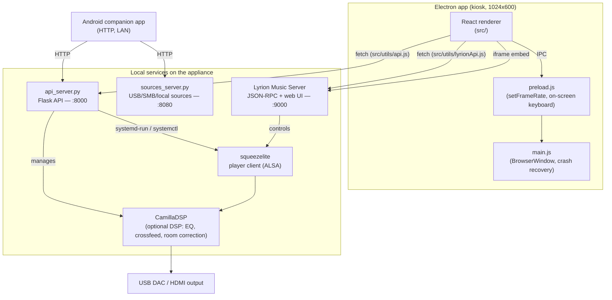

# Architecture

Technical reference for how Osmium Sound is put together — components,
processes, ports, update pipeline, and project layout. For a user-facing
overview, features, and specs, see [README.md](README.md).

## System overview



## Components

| Component | Path | Role |
|---|---|---|
| Electron main | `main/main.js` | Window/kiosk management, renderer crash recovery, relaxes CSP only for the local Lyrion origin so it can be embedded |
| Preload | `main/preload.js` | Minimal `contextBridge` surface — only UI-local concerns (frame-rate cap, global on-screen keyboard). **System control does not go through IPC.** |
| React renderer | `src/` | The touchscreen UI (Now Playing, Music/Radio/Apps via Lyrion, Settings, Setup Wizard) |
| Flask API | `api_server.py` | Runs as root on the appliance; system info/control, network/Wi-Fi, OTA channels, DSP, multiroom (LMS role), pairing tokens. Port `8000`. |
| Sources service | `sources_server.py` | USB/SMB/local music source management, backup/restore. Port `8080`. |
| Lyrion Music Server | external (Debian package / on-demand download) | Library indexing, playback engine, plugin ecosystem (Spotty, TIDAL Connect, radio, UPnP/DLNA, AirPlay). Port `9000`. |
| squeezelite | systemd service | Lyrion's player client; `-D` flag enables bit-perfect DSD via DoP; `-v` exports a shared-memory buffer the VU meter reads |
| CamillaDSP | systemd-managed, optional | Parametric EQ, headphone crossfeed, room correction from an uploaded filter. Off by default — bit-perfect path is untouched unless enabled. |
| Android companion | `android-companion/` | Native Android app; talks to the Flask API and Lyrion over HTTP/LAN after QR-code pairing |

### Appliance systemd services

`hifi-api` (Flask API) · `hifi-sources` (sources service) · `hifi-vumeter` (VU meter shared-memory reader) · `hifi-firstboot` (first-boot provisioning) · `squeezelite`

## Backend API reference

The renderer never talks to the OS directly — everything goes through one of
two local HTTP services.

### Flask API — `api_server.py` (port 8000)

Called via [`src/utils/api.js`](src/utils/api.js) (`apiGet`/`apiPost`). Selected routes:

```
GET  /system_info            hostname, platform, arch, versions
GET  /network_info           network interfaces
GET  /audio_devices           detected DACs/outputs
POST /set_audio_device
POST /reboot | /shutdown
GET/POST /ota_channel        dev | prod
GET/POST /{app,system,os,lyrion}_update/{check,apply,status}
GET/POST /dsp_status, /dsp_set
GET/POST /lms_role           multiroom "follow" mode
GET/POST /player_name
GET  /discover_lms            LAN auto-discovery for multiroom
GET/POST /ssh_status, /ssh_set
GET/POST /pointer_status, /pointer_set
```

The full route table is the source of truth — see the `@app.route` decorators
in `api_server.py`.

### Lyrion JSON-RPC — `src/utils/lyrionApi.js` (port 9000)

Playback control talks directly to Lyrion, not the Flask API:

```javascript
lyrionApi.play(playerMac)
lyrionApi.pause(playerMac)
lyrionApi.next(playerMac)
lyrionApi.previous(playerMac)
lyrionApi.setVolume(playerMac, volume)   // 0-100
lyrionApi.seek(playerMac, time)
```

### Electron preload — `main/preload.js`

```javascript
window.electronAPI.setFrameRate(fps)
window.electronAPI.showGlobalKeyboard() / hideGlobalKeyboard()
window.electronAPI.onToggleSimpleKeyboard(callback)
```

## OTA update system

Four independent channels, all served from GitHub Releases:

| Channel | Asset prefix | Updates | Verification |
|---|---|---|---|
| UI | `hifi-ui-` | `/opt/hifi-media-player` (Electron) | sha256 |
| System | `hifi-system-` | Python API/daemons, helper scripts, systemd units | sha256 |
| OS | `hifi-os-` | arbitrary root `apply.sh` | sha256 **+ Ed25519 signature** |
| Lyrion | — | Lyrion Music Server `.deb` | version match |

The OS channel is signed because its payload runs an arbitrary root script;
the signature is checked against a public key baked into the image
(`/etc/hifi-player/ota-pubkey.pem`) before the sha256-verified tarball is
applied. `distro/os-update/apply.sh` is **cumulative** — every OS change ever
shipped lives there as an idempotent block, since a device jumping straight to
the latest release only ever runs the latest `apply.sh` once.

Devices also pick a **Dev** or **Prod** release channel (Settings → Updates):
`main` tags (`vX.Y.Z`) are the Prod channel; `svil` prerelease tags
(`vX.Y.Z-dev.N`) are the Dev channel and are never picked up by
`releases/latest`.

Note that not every stable release ships a new install ISO — most releases
are OTA-only (OS/System/UI tarballs); a fresh ISO is only cut occasionally.
Check the release's assets on GitHub to see what shipped with it.

## Project structure

```
hifi-media-player/
├── main/                    # Electron main process
│   ├── main.js
│   └── preload.js
├── src/                     # React renderer
│   ├── components/
│   ├── pages/               # Settings, SetupWizard, LyrionServer, ...
│   ├── utils/                # api.js (Flask), lyrionApi.js (Lyrion JSON-RPC)
│   └── i18n/                 # en/it locale strings
├── api_server.py            # Flask API (system/network/OTA/DSP/multiroom)
├── sources_server.py         # USB/SMB/local music sources
├── android-companion/       # Android companion app (Kotlin/Java)
├── distro/                  # Custom Debian appliance build (live-build)
│   ├── config/               # live-build includes, hooks, systemd units
│   └── os-update/            # apply.d migrations, apply.sh (cumulative)
├── website/                  # Marketing site (website/index.html)
└── package.json
```

## Local development

```bash
npm install
npm run electron:dev   # Vite + Electron with hot reload
npm run build           # production renderer build
npm run electron        # run the built app
npm run package         # electron-builder distributable
```

`install-dietpi.sh` / `start-fullscreen.sh` are developer conveniences for
testing on a bare DietPi/Debian box by hand — they are **not** how the
appliance ships. The real production path is: flash the install ISO once,
then let the OTA system above keep the device (UI, System, OS, Lyrion) up to
date.
