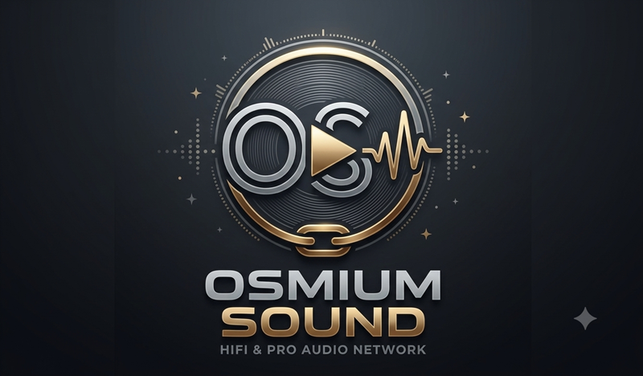

# Osmium Sound

**A touchscreen-first hi-fi media appliance for x86, built on Debian.**
Bit-perfect audio, streaming services, and signed OTA updates — one sleek dark interface.

[**🌐 Website**](https://osmiumsound.it) · [**⬇️ Download**](https://github.com/adri6412/osmium-sound/releases) · [**📱 Android companion**](https://github.com/adri6412/osmium-sound/releases?q=companion) · [**📖 Architecture**](ARCHITECTURE.md)

---

## ✨ Features

- 🎵 **High-resolution audio** — FLAC, DSD (DoP), PCM up to 192kHz, bit-perfect (no resampling)
- 🎧 **Streaming services** — Deezer, Qobuz, TIDAL, Spotify and more, via Lyrion plugins
- 📁 **Music library** — browse by artist, album, folder or playlist, fast indexing
- 💿 **CD playback & ripping** — insert a disc, play it or rip it to tagged FLAC (MusicBrainz metadata + cover art) straight into your library
- 🧭 **Discover** — endless random mixes, "keep playing similar music", similar artists and artist bios on the touchscreen
- 📻 **Internet radio** — thousands of stations, save favourites from the touchscreen
- 🔌 **DAC auto-detection** — persistent output selection across reboots
- 🎚️ **Optional DSP** — parametric EQ, headphone crossfeed, room correction (off by default)
- 🎤 **Guided room correction** — measure the room with a USB mic (e.g. UMIK-1) right from the touchscreen; the correction FIR is generated on-device, no PC needed
- 🔊 **Multiroom** — group Osmium Sound devices to play in sync
- 📱 **Android companion app** — browse, control playback/queue, adjust volume, pair by QR code
- ⬆️ **Signed OTA updates** — Ed25519-signed, Dev and Prod release channels

## 📋 Specs

| | |
|---|---|
| **Hardware** | x86 / x86-64 mini-PC |
| **Display** | 1024×600 touchscreen (optimized for this resolution) |
| **OS** | Custom Debian appliance distro |
| **Interface** | Electron + React |
| **Media server** | Lyrion Music Server |
| **Audio formats** | FLAC, DSD (64/128/256), MP3, AAC, WAV, AIFF |
| **Max resolution** | 32-bit / 192kHz PCM |
| **Output** | USB DAC, HDMI |
| **Update system** | Signed OTA (Ed25519), Dev/Prod channels |
| **License** | MIT (app code) — see [Licensing](#-licensing) |

## 🚀 Get started

1. **Download** the latest install ISO from [Releases](https://github.com/adri6412/osmium-sound/releases).
2. **Flash** it to an 8GB+ USB stick with [balenaEtcher](https://etcher.balena.io/), Rufus, or `dd`.
3. **Boot** your x86 mini-PC from the stick — the screen shows a QR code, nothing else. Scan it with your phone and finish everything from there: pick the disk, confirm, install. No mouse or keyboard ever needed.
4. On first boot after install, the screen shows a QR code again. Scan it to finish setup (language, network, device mode, audio output, Lyrion, music sources, time zone) from your phone. Reboot — done.

Every later version — UI, system, OS, and Lyrion — arrives automatically over the air from the Settings screen. No reflashing required.

> **Fully hands-off, screen-only workflow.** Both the installer and the first-boot setup wizard are QR-only: the on-screen kiosk never asks for input, it only displays a hotspot QR code and waits. A phone connected to that hotspot drives every actual step (disk choice, language, restore-from-backup, network, device mode, audio, Lyrion, sources, time zone) via a lightweight web page — see [ARCHITECTURE.md § Provisioning & first boot](ARCHITECTURE.md#provisioning--first-boot).

> **Try it live.** Pick **Try Osmium Sound (no install)** at the boot menu to run the kiosk straight from the USB stick, nothing is written to disk. If it doesn't log in automatically, use `hifi` / `hifi` at the login screen.

Want to run the UI locally for development instead of flashing an appliance? See [ARCHITECTURE.md](ARCHITECTURE.md#local-development).

## 📱 Android companion

Control Osmium Sound from your phone — browse the library, drive playback and the queue, adjust volume. Pair in seconds by scanning the QR code on the device's Settings screen. Distributed as a signed APK or via our self-hosted F-Droid repo (not on the Play Store) — see the [website](https://osmiumsound.qd.je/#android) for details.

## 📖 Documentation

- **[ARCHITECTURE.md](ARCHITECTURE.md)** — components, ports, backend API reference, OTA internals, project layout, local dev setup
- **[QUICKSTART.md](QUICKSTART.md)** — quick start guide (also in [Italian](GUIDA-RAPIDA.md))
- **[MANUALE.html](MANUALE.html)** — full installation & configuration manual (English/Italian toggle)
- **[SECURITY.md](SECURITY.md)** — security policy
- Release notes: [website changelog](https://osmiumsound.qd.je/#changelog)

## 📄 Licensing

**The application code authored by this project** (Electron/React frontend, Python services, distro packaging, hardware designs) is released under the **MIT License** — see [`LICENSE`](LICENSE).

**This project also includes and redistributes third-party components** under their own licenses (Lyrion Music Server and squeezelite under GPL, Android companion app under Apache-2.0, npm/Python dependencies under MIT/BSD/ISC). See [`THIRD-PARTY-NOTICES.md`](THIRD-PARTY-NOTICES.md) for the complete list, license texts, and source locations.

**Disclaimer of affiliation:** Osmium Sound is an independent open-source project and is **NOT affiliated with, sponsored by, endorsed by, or officially associated with** the Lyrion Music Server project or the LMS-Community. "Lyrion" is used in a nominative sense only, to describe the service this frontend connects to.

## 🤝 Contributing & support

Contributions are welcome — pull requests and issues are open on [GitHub](https://github.com/adri6412/osmium-sound). For questions, open an issue or check the docs above.

---

**Built with ❤️ for music lovers**

