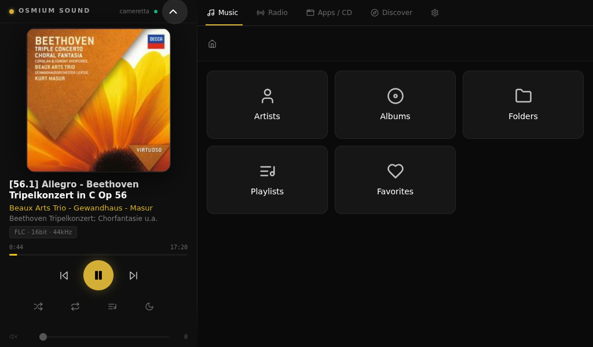

# Osmium Sound

**A touchscreen-first hi-fi media appliance for x86, built on Debian.**
Bit-perfect audio, streaming services, and signed OTA updates — one sleek dark interface.

[**🌐 Website**](https://osmiumsound.it) · [**⬇️ Download**](https://github.com/adri6412/osmium-sound/releases) · [**📱 Android companion**](https://github.com/adri6412/osmium-sound/releases?q=companion) · [**📖 Architecture**](ARCHITECTURE.md)

---

## ✨ Features

- 🎵 **High-resolution audio** — FLAC, DSD (DoP), PCM up to 192kHz, bit-perfect (no resampling)
- 🎧 **Streaming services** — Deezer, Qobuz, TIDAL, Spotify and more, via Lyrion plugins
- 📁 **Music library** — browse by artist, album, folder or playlist, fast indexing
- 💾 **Music sources** — USB drives, internal disks (adopt or format from the UI), NAS/SMB shares; adopted disks can be shared back on the LAN over SMB
- 💿 **CD playback & ripping** — insert a disc, play it or rip it to tagged FLAC (MusicBrainz metadata + cover art) straight into your library
- 🧭 **Discover** — endless random mixes, "keep playing similar music", similar artists and artist bios on the touchscreen
- 📻 **Internet radio** — thousands of stations, save favourites from the touchscreen
- 🖥️ **With screen or headless** — touchscreen kiosk, headless (web admin + companion app), or server-only (serves Lyrion to other players, plays nothing itself)
- 🌐 **Web admin** — manage a unit from any browser on the LAN (network, audio, sources, updates, backups, SSH, Tailscale remote access)
- 📱 **Android companion app** — browse, control playback/queue, adjust volume, pair by QR code
- 💼 **Backup & restore** — profile backups (settings, sources, Lyrion prefs, optionally Wi-Fi/accounts encrypted), scheduled or on demand, restorable even from the first-boot wizard
- ⬆️ **Signed OTA updates** — Ed25519-signed OS payloads, Prod / Dev release channels (plus a private Alpha channel for testers)

## 📋 Specs

| | |
|---|---|
| **Hardware** | x86-64 mini-PC (Intel iGPU-class graphics is plenty) |
| **Display** | 1024×600 touchscreen (optimized for this resolution); headless operation also supported |
| **OS** | Custom Debian 13 ("trixie") appliance image built with live-build |
| **Interface** | Electron + React kiosk on a Wayland (labwc) session, with automatic X11 fallback where no real GPU is present |
| **Media server** | Lyrion Music Server (installed on first boot), web player on Material Skin with the "Osmium" theme |
| **Audio formats** | FLAC, DSD (64/128/256), MP3, AAC, WAV, AIFF |
| **Max resolution** | 32-bit / 192kHz PCM |
| **Output** | USB DAC, HDMI |
| **Update system** | Signed OTA (Ed25519), Prod/Dev channels |
| **License** | MIT (app code) — see [Licensing](#-licensing) |

## 🚀 Get started

1. **Download** the latest install ISO from [Releases](https://github.com/adri6412/osmium-sound/releases) (or use **Osmium Flasher**, see `flasher/`, which downloads and verifies the current image for you).
2. **Flash** it to an 8GB+ USB stick with [Osmium Flasher](https://osmiumsound.it), [balenaEtcher](https://etcher.balena.io/), Rufus, or `dd`.
3. **Boot** your x86 mini-PC from the stick and finish the install from there: pick the disk, confirm, done.
4. On first boot after install, the screen shows its own address (`http://<ip>`). Open it on your phone or laptop to finish setup: language, restore-from-backup or fresh start, device name and mode, audio output, Lyrion, web-player look, music services, web-admin account, time zone, music sources.

Every later version — UI, system, OS, and Lyrion — arrives automatically over the air from the Settings screen (or the web admin). No reflashing required.

> **Try it live.** Pick **Try Osmium Sound (no install)** at the boot menu to run the kiosk straight from the USB stick, nothing is written to disk. If it doesn't log in automatically, use `hifi` / `hifi` at the login screen.

## 📱 Android companion

Control Osmium Sound from your phone — browse the library, drive playback and the queue, adjust volume, switch audio output, manage multiroom, updates, backups and basic system settings. Pair in seconds by scanning the QR code on the device's Settings screen. Distributed as a signed APK or via our self-hosted F-Droid repo (not on the Play Store) — see the [website](https://osmiumsound.it/#android) and [COMPANION_APP.md](COMPANION_APP.md).

## 📖 Documentation

- **[ARCHITECTURE.md](ARCHITECTURE.md)** — components, ports, backend API reference, provisioning flow, OTA internals, project layout, local dev setup
- **[QUICKSTART.md](QUICKSTART.md)** — quick start guide (also in [Italian](GUIDA-RAPIDA.md))
- **[User manual](https://osmiumsound.it/manual.html)** — full installation & configuration manual on the website (English/Italian)
- **[COMPANION_APP.md](COMPANION_APP.md)** — the Android companion app
- **[distro/README.md](distro/README.md)** — building the appliance ISO; **[flasher/README.md](flasher/README.md)** — the desktop USB flasher
- **[.github/workflows/README.md](.github/workflows/README.md)** — CI: release, OTA, ISO, companion and website workflows; **[TAG_CONVENTIONS.md](.github/workflows/TAG_CONVENTIONS.md)** — tags, branches and release channels
- **[SECURITY.md](SECURITY.md)** — security policy and the appliance's security model
- Release notes ship with every GitHub Release (auto-generated `CHANGELOG_RELEASE.md`, also shown as "what's new" in the Updates screens)

## 📄 Licensing

**The application code authored by this project** (Electron/React frontend, Vue web admin, Python services, distro packaging, flasher, hardware designs) is released under the **MIT License** — see [`LICENSE`](LICENSE).

**This project also includes and redistributes third-party components** under their own licenses (Lyrion Music Server and squeezelite under GPL, Android companion app under Apache-2.0, npm/Python dependencies under MIT/BSD/ISC). See [`THIRD-PARTY-NOTICES.md`](THIRD-PARTY-NOTICES.md) for the complete list, license texts, and source locations.

**Disclaimer of affiliation:** Osmium Sound is an independent open-source project and is **NOT affiliated with, sponsored by, endorsed by, or officially associated with** the Lyrion Music Server project or the LMS-Community. "Lyrion" is used in a nominative sense only, to describe the service this frontend connects to.

## 🤝 Contributing & support

Contributions are welcome — pull requests and issues are open on [GitHub](https://github.com/adri6412/osmium-sound). For questions, open an issue, write to support@osmiumsound.it, or check the docs above.

If Osmium Sound is useful to you, you can support its development on Ko-fi:

---

**Built with ❤️ for music lovers**

